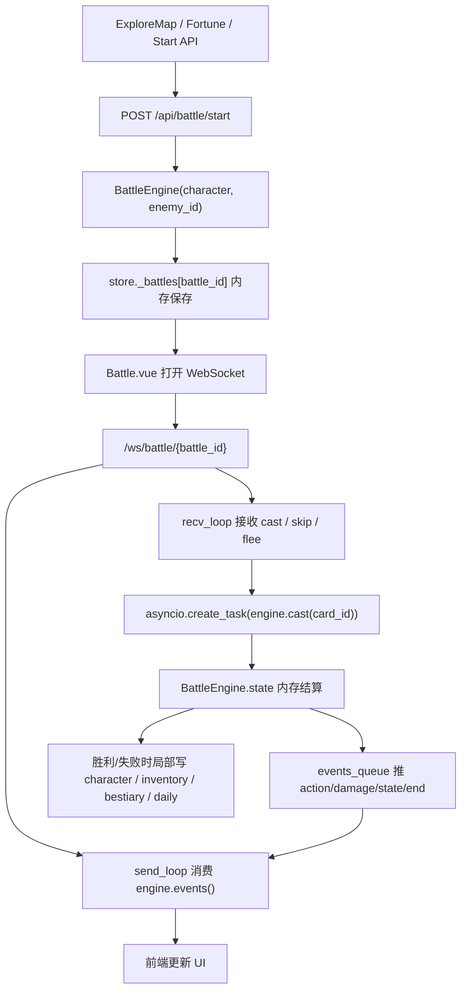
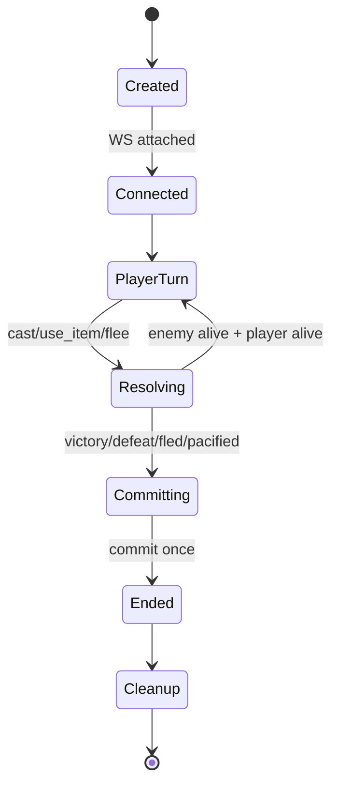

# 灵枢笔录 · 战斗模块逻辑漏洞审计报告

> 审计日期:2026-05-25  
> 项目路径:`/Users/bobdong/项目/LingshuCodex`  
> 审计对象:战斗引擎、战斗 WebSocket、战斗前端、叙事流、掉落奖励、背包道具、图鉴/日课/修行录联动  
> 审计结论:当前战斗模块最大风险不是单个数值公式,而是 **战斗内存状态 `BattleEngine.state` 与持久化角色 `character` 双轨运行,但缺少统一提交/回滚机制**。其次是 WebSocket 出招没有互斥锁与回合令牌,会导致状态机被客户端连发消息打穿。

---

## 1. 审计范围

本次审计覆盖以下文件:

| 文件 | 作用 | 审计重点 |
|---|---|---|
| `backend/app/battle.py` | 单场战斗引擎、回合结算、奖励、掉落、叙事任务 | 状态机、数值结算、持久化、异步任务 |
| `backend/app/main.py` | REST API、WebSocket 战斗入口、赠礼、背包使用 | WS 并发、战斗创建、接口契约 |
| `backend/app/llm_client.py` | 战斗叙事、预生成池、章节生成 | 叙事和数值一致性、后台任务泄漏 |
| `backend/app/cards.py` | 玩家卡牌定义 | 卡牌成本、卡牌效果、描述与实现一致性 |
| `backend/app/monster_skills.py` | 怪物技能表 | 技能概率、命中、特殊效果落地情况 |
| `backend/app/store.py` | SQLite 存储、战斗内存表、背包、图鉴、日课 | 写入原子性、并发覆盖、内存战斗生命周期 |
| `frontend/src/views/Battle.vue` | 战斗页面、WS 消费、出招、队列、吃药、结算 | 前后端状态同步、UI 防抖是否可信 |
| `frontend/src/components/GiftDialog.vue` | 战斗赠礼弹窗 | 赠礼次数、扣物品、结束状态 |
| `frontend/src/api/client.js` | 前端 API 封装 | 是否存在 battle 专用接口、接口契约 |

---

## 2. 战斗模块当前架构

当前战斗系统采用“内存战斗实例 + WebSocket 事件队列”的实现方式:



这个架构的好处是战斗数值能很快结算,LLM 叙事不阻塞主流程。但它也带来三个结构性风险:

1. **状态双轨**:战斗中真实数值在 `engine.state`,角色存档在 SQLite 的 `character` JSON。两者没有统一同步点。
2. **异步并发**:WebSocket 收消息后用 `create_task` 启动 `cast`,没有等待上一招完成。
3. **生命周期分散**:战斗实例保存在内存,叙事/章节/预生成池又是独立后台任务,清理责任不集中。

---

## 3. 核心结论

当前战斗模块存在 4 类高优根因:

### 3.1 根因一:战斗状态与角色存档没有统一提交

`BattleEngine.state` 中有:

```text
player_hp / player_qi / enemy_hp / buffs / destiny / round / status
```

SQLite 角色存档中也有:

```text
hp / qi / exp / level / attrs / battle_history / drop_pity
```

但胜利、失败、撤退、吃药、赠礼分别从不同路径写入不同字段。结果是:

- 战斗中扣血不一定写回角色。
- 战斗中耗灵气不一定写回角色。
- 背包吃药写了角色,没有写战斗引擎。
- 前端有时只是本地改 `state.value`,没有后端真实生效。
- `battle_history` 字段存在,但战斗结束时没有写入。

这是最根本的问题。

### 3.2 根因二:后端信任前端节奏

前端做了 `battlePhase`、`castQueue`、按钮禁用等限制,但后端没有足够校验:

- `cast()` 只检查 `is_finished()`,不检查是否是 `player_turn`。
- WebSocket 对 cast 使用 `asyncio.create_task`,可并发进入。
- 赠礼次数信任前端传入的 `gift_count_so_far`。
- 多标签页可对同一战斗或多场战斗同时操作。

游戏规则必须由服务端保证,不能只靠前端 UI。

### 3.3 根因三:战斗生命周期没有 owner

`chapter_task`、`current_narration_task`、`_refill_pool()`、`warmup_pool()` 都可能在战斗结束或 WebSocket 断开后继续运行。BYOK 游戏里,这不只是内存问题,还会变成真实 token 成本问题。

### 3.4 根因四:内容/数值/叙事有多处契约不一致

- 卡牌预览命中率和真实命中率公式不一致。
- 预生成叙事池是“普通攻击”,实际可被任何非暴击招式消费。
- 怪物技能里的 `effect` 基本只用于叙事,没有数值落地。
- `灵丹` 卡是无限 0 成本回血,但背包里也有丹药系统。
- 赠礼胜利后端 result 和前端展示 result 不一致。

---

## 4. 严重等级总览

本报告合并用户提供的问题与本次复查新增问题,按真实风险去重后分为:

| 等级 | 数量 | 定义 |
|---|---:|---|
| P0 致命 | 10 | 直接破坏战斗状态机、资源经济、存档正确性,或容易被玩家利用 |
| P1 高危 | 13 | 明显影响战斗公平、数值平衡、成本控制、长期系统闭环 |
| P2 中度 | 15 | 边界条件、体验一致性、数据统计、内容契约问题 |
| P3 轻微 | 9 | 展示、文案、可维护性、后续扩展风险 |

---

## 5. P0 致命问题

### P0-1:撤退不会同步战斗内 HP/Qi,导致免费回档

**位置**

- `backend/app/battle.py`, `flee()`
- `frontend/src/views/Battle.vue`, `flee()` 和返回地图逻辑

**现象**

`flee()` 只做:

```python
self.state["status"] = "ended"
self.state["result"] = "fled"
await self._push({"type": "end", "data": {"result": "fled"}})
```

它没有把战斗内的:

```text
self.state["player_hp"]
self.state["player_qi"]
```

写回 `character["hp"]` / `character["qi"]`。

**为什么严重**

玩家可以:

```text
进入战斗 -> 用高耗灵气招式试伤害 -> 被打残 -> 撤退 -> 角色存档仍保持战斗前状态
```

这等于免费试错、免费探怪、免费消耗。RPG 的补给、风险、撤退代价都会失效。

**更深层问题**

撤退不是唯一问题,它只是暴露了“战斗内状态没有统一提交”的架构漏洞。胜利、战败、吃药也有同类问题。

**修复建议**

新增统一方法:

```python
def _sync_survival_state_to_character(self, result: str):
    char = get_character(self.user_id)
    if not char:
        return
    char["hp"] = max(1 if result in ("fled", "defeat") else 0, self.state["player_hp"])
    char["qi"] = max(0, self.state["player_qi"])
    save_character(self.user_id, char)
```

撤退时可按策划决定:

| 策略 | 效果 |
|---|---|
| 保留当前 HP/Qi | 最公平,战斗中消耗都真实 |
| HP 至少保留 1 | 避免撤退后死亡状态 |
| 额外扣疲劳/材料 | 强化撤退代价 |

**验收标准**

1. 战斗中扣到半血后撤退,`/api/character/me` 返回半血或策划规定的撤退血量。
2. 战斗中消耗灵气后撤退,角色灵气不回到战前值。
3. 刷新页面后状态仍正确。

---

### P0-2:胜利只写奖励,不写战斗后 HP,导致战损不持久

**位置**

- `backend/app/battle.py`, victory 分支
- `backend/app/battle.py`, `_grant_rewards()`

**现象**

胜利分支会调用:

```python
level_up_info = self._grant_rewards(reward_data)
```

而 `_grant_rewards()` 只处理:

```text
exp
qi
level
attrs
realm
```

它没有把本场战斗结束后的 `self.state["player_hp"]` 写回 `char["hp"]`。

**后果**

如果玩家胜利时剩余 10% HP,战斗结束后存档仍可能是战前 HP。除非升级触发满血,否则战斗伤害不会成为长期资源消耗。

**玩家感知**

玩家会发现:

- 打完怪回主城,血量像没掉过。
- 药品价值很低。
- 持续战斗没有“越打越疲惫”的感觉。
- 挑战强敌几乎没有代价。

**修复建议**

`_grant_rewards()` 不应只 grant reward,建议拆成:

```python
_commit_battle_result(result, rewards)
```

统一提交:

```text
hp / qi / exp / level / attrs / realm / battle_history / daily / journal / drop_pity
```

**验收标准**

1. 胜利后角色 HP 等于战斗最终 HP。
2. 升级时若策划要求满血,应由升级逻辑明确覆盖,并在结算事件里告诉前端。
3. 不升级胜利时不得自动满血。

---

### P0-3:战败推送状态与实际存档顺序不一致

**位置**

- `backend/app/battle.py`, defeat 分支
- `backend/app/battle.py`, `_apply_defeat_penalty()`

**现象**

战败分支顺序是:

```python
self.state["status"] = "ended"
self.state["result"] = "defeat"
await self._push({"type": "state", "data": self.snapshot()})
self._apply_defeat_penalty()
await self._push({"type": "end", "data": {"result": "defeat"}})
```

也就是说前端先收到的状态可能是:

```text
player_hp = 0
```

但数据库里随后被写成:

```text
char["hp"] = 1
char["exp"] -= 5
```

**后果**

前端显示、结算弹窗、本地 store、数据库出现分叉。

**修复建议**

战败应先决定最终持久化结果,同步到 `engine.state`,再推送 state:

```python
self._apply_defeat_penalty_to_state()
self._commit_battle_result("defeat")
await self._push({"type": "state", "data": self.snapshot()})
await self._push({"type": "end", "data": {"result": "defeat", "penalty": ...}})
```

**验收标准**

战败后:

- UI 显示 HP 1。
- `/api/character/me` 显示 HP 1。
- 刷新后仍为 HP 1。

---

### P0-4:战斗中吃药写角色存档,不写战斗引擎

**位置**

- `backend/app/main.py`, `/api/inventory/use/{item_id}`
- `frontend/src/views/Battle.vue`, `useItem(item)`
- `frontend/src/api/client.js`, `inventoryApi.use`

**重要校正**

当前项目里没有独立的 `/api/battle/use-item` 端点。战斗页吃药实际调用的是通用背包接口:

```js
inventoryApi.use(item.id)
```

该接口只修改 SQLite 中的 `character`,不修改内存中的 `BattleEngine.state`。

前端随后执行:

```js
state.value.player.hp = data.character.hp
state.value.player.qi = data.character.qi
```

这只是 UI 层改值,后端战斗引擎仍按旧血量、旧灵气计算。

**后果**

典型表现:

```text
战斗中吃回血丹 -> 前端血条涨了 -> 敌人下次攻击仍按后端旧 HP 结算 -> 玩家突然死亡
```

或:

```text
战斗中吃回灵丹 -> 前端灵气涨了 -> 点高耗招式 -> 后端说灵气不足
```

**修复建议**

新增 battle 专用接口或 WS action:

```text
POST /api/battle/{battle_id}/use-item
```

或:

```json
{ "action": "use_item", "payload": { "item_id": "..." } }
```

由 `BattleEngine` 提供:

```python
async def use_item(self, item_id: str):
    # 1. 检查 status 是否允许
    # 2. 检查背包
    # 3. 应用到 self.state
    # 4. 扣背包
    # 5. 推 state/item_used
```

**验收标准**

1. 战斗中吃药后,下一次敌人攻击基于新 HP。
2. 战斗中回灵后,下一次出招基于新 Qi。
3. 断线重连后,战斗快照显示的是引擎真实状态。

---

### P0-5:WebSocket cast 并发执行,战斗状态机可被打穿

**位置**

- `backend/app/main.py`, `recv_loop()`
- `backend/app/battle.py`, `cast()`

WebSocket 收到 cast 后:

```python
asyncio.create_task(engine.cast(card_id))
```

这意味着后端不会等待上一招结算完成,下一条 cast 消息可以立即进入。

`cast()` 内部有大量 `await self._push(...)`,这些 await 会让出事件循环。只要客户端快速连发,多个 `cast()` 可以交错执行,共同修改:

```text
round
status
player_qi
enemy_hp
player_hp
buffs.focus_next
destiny_used
history
result
```

**为什么前端防不住**

前端的 `battlePhase` 和按钮禁用只能限制正常用户点击。脚本、浏览器控制台、多标签页、网络重放都可以绕过。

**可能后果**

| 竞态点 | 后果 |
|---|---|
| 多个 cast 同时通过 `is_finished()` | 结束后仍可能继续结算 |
| 多个 cast 同时扣灵气 | 灵气扣成异常值或越过校验 |
| 多个 cast 同时改 enemy_hp | 一回合多次输出 |
| 多个 cast 同时触发 victory | 奖励/掉落/日课重复 |
| 多个 cast 与 flee/gift 并发 | 战斗 result 被覆盖 |

**修复建议**

在 `BattleEngine.__init__` 中:

```python
self._action_lock = asyncio.Lock()
```

在所有改变战斗主状态的方法上使用同一把锁:

```python
async def cast(self, card_id: str):
    async with self._action_lock:
        ...
```

同样需要覆盖:

```text
cast
flee
use_item
gift success/failure 对 engine.state 的修改
```

**验收标准**

1. 100ms 内连发 10 条 cast,服务端最多执行 1 条。
2. 非 player_turn 期间发送 cast,服务端返回错误,不会改变 round/q/i/hp。
3. 结算奖励只执行一次。

---

### P0-6:cast 不校验当前是否是玩家回合

**位置**

- `backend/app/battle.py`, `cast()`

当前开头只有:

```python
if self.is_finished():
    ...
```

缺少:

```python
if self.state["status"] != "player_turn":
    ...
```

**后果**

只要战斗未结束,客户端理论上可以在以下状态出招:

```text
processing
enemy_turn
ended 前的事件尾部
```

这会破坏回合制基本规则。

**修复建议**

`cast()` 进入锁后第一时间检查:

```python
if self.state["status"] != "player_turn":
    await self._push({"type": "error", "data": {"message": "尚未轮到你出手"}})
    return
```

**验收标准**

1. 敌方回合发送 cast 不扣灵气。
2. 敌方回合发送 cast 不增加 round。
3. 敌方回合发送 cast 不触发 damage/action_resolved。

---

### P0-7:战斗历史已部分写入,但仍不是完整的结果提交机制

**位置**

- `backend/app/main.py`, `start_battle()`
- `backend/app/attributes.py`, 初始角色字段
- `frontend/src/views/Home.vue`, 主城战绩展示
- `backend/app/battle.py`, `_record_battle_to_character()`

`start_battle()` 中:

```python
is_first_battle = len(char.get("battle_history", [])) == 0
if is_first_battle and req.enemy_id != "tutorial_enemy":
    tutorial_enemy_id = "fox_01"
```

二次复审时发现当前源码已经在普通胜利、战败、撤退路径里调用:

```python
self._record_battle_to_character("victory")
self._record_battle_to_character("defeat")
self._record_battle_to_character("fled")
```

所以“普通战斗完全不写 battle_history”的旧判断已经不准确。当前真实问题是:

- `battle_history` 只是单独追加历史,不是统一 battle commit 的一部分。
- 它不会同步战斗结束时的 HP/Qi。
- 它没有幂等保护,重复结束流程仍可能追加多条历史。
- 赠礼胜利在 `main.py/give_gift()` 中结束战斗,没有调用 `_record_battle_to_character()`。
- 如果第一战通过赠礼和平结束,仍可能不进入历史,首战判断会继续异常。

**后果**

普通胜利/失败/撤退已经能让首战教学大概率结束,但历史系统仍然不可靠。具体影响:

- 主城战绩可能漏掉赠礼胜利。
- 奇遇系统拿到的 recent_battles 不完整。
- 多次 end/并发结束可能重复写历史。
- 长期留存里的“修行履历”失效。

**修复建议**

战斗结束统一写入:

```python
char["battle_history"].append({
    "battle_id": self.battle_id,
    "enemy_id": self.state["enemy_id"],
    "enemy_name": self.state["enemy_name"],
    "result": result,
    "round_count": self.state["round"],
    "mode": self.mode,
    "ended_at": int(time.time()),
    "rewards": compact_rewards,
})
char["battle_history"] = char["battle_history"][-50:]
```

同时建议新增:

```text
character.flags.first_battle_done = true
```

不要再用 `battle_history.length == 0` 判断教学状态。

**验收标准**

1. 第一战结束后再次开战,不会继续强制进入 `fox_01`。
2. 普通胜利、战败、撤退、赠礼胜利都能写入主城战绩。
3. 奇遇 prompt 能看到 recent_battles。
4. 同一场战斗不会被重复写入多条历史。

---

### P0-8:同一玩家可同时开启多场战斗,奖励和存档会互相覆盖

**位置**

- `backend/app/main.py`, `/api/battle/start`
- `backend/app/store.py`, `_battles`

当前 `_battles` 结构是:

```python
_battles: dict[str, object] = {}
```

按 `battle_id` 保存,没有玩家维度的 active battle 限制。`/api/battle/start` 每调用一次都会创建一个新 `BattleEngine`。

**后果**

玩家可以多标签页同时开多场战斗:

```text
Tab A 战斗消耗 HP/Qi
Tab B 战斗也消耗 HP/Qi
Tab A 先胜利写奖励
Tab B 后胜利用旧角色 JSON 覆盖新角色 JSON
```

这会导致:

- 奖励重复或丢失。
- HP/Qi 回档。
- drop_pity 覆盖。
- 日课计数异常。
- 图鉴击杀数异常。

**修复建议**

在 store 中增加:

```python
_active_battle_by_user: dict[str, str]
```

策略二选一:

| 策略 | 描述 |
|---|---|
| 严格单战斗 | 如果已有 active battle,返回原 battle_id |
| 新战斗替换旧战斗 | 新开战时自动标记旧战斗 abandoned 并 cleanup |

**验收标准**

1. 同一玩家重复调用 start 不产生多个 active battle。
2. 多标签页打开旧 battle 不会影响新 battle。
3. 旧 battle 结束不会覆盖新 battle 存档。

---

### P0-9:赠礼次数由前端上报,可绕过三次限制

**位置**

- `backend/app/main.py`, `GiveGiftRequest.gift_count_so_far`
- `frontend/src/components/GiftDialog.vue`
- `frontend/src/api/client.js`, `giftApi.give`

后端限制:

```python
if req.gift_count_so_far >= 3:
    raise HTTPException(400, "本场战斗已赠礼 3 次")
```

但这个值来自前端:

```js
giftApi.give(props.battleId, item.id, props.giftCount)
```

恶意请求永远传 `0`,即可无限赠礼。

**后果**

- 三次上限失效。
- 可无限消耗低价值物品刷接受概率。
- 赠礼成功可结束战斗并给经验,可能成为刷经验路线。

**修复建议**

赠礼次数必须保存在服务端:

```python
self.state["gift_count"] = 0
```

或:

```python
engine.gift_count
```

每次赠礼由服务端自增。前端只展示服务端返回的 remaining。

**验收标准**

1. 手工请求传 `gift_count_so_far=0` 超过三次仍被拒绝。
2. 断线重连后赠礼次数不重置。
3. 已结束战斗不能继续赠礼。

---

### P0-10:灵气消耗全路径没有可靠持久化,战斗成本会被回滚

**位置**

- `backend/app/battle.py`, `cast()`
- `backend/app/battle.py`, `_grant_rewards()`
- `backend/app/battle.py`, `_record_battle_to_character()`
- `frontend/src/views/Battle.vue`, `returnToMap()` / `backToHome()`

**现象**

玩家出招时只扣内存态:

```python
self.state["player_qi"] -= card.qi_cost
```

普通胜利时 `_grant_rewards()` 是从角色存档原始 qi 上加奖励:

```python
char["qi"] = min(char.get("max_qi", 800), char.get("qi", 0) + rewards.get("qi", 0))
```

它没有先把战斗内 `player_qi` 写回角色,所以本场所有出招消耗都可能被忽略。撤退路径也只调用 `_record_battle_to_character()`,不会写 qi。

**后果**

战斗中的“灵气成本”不构成真实资源消耗:

```text
角色进战 1000 Qi
战斗中消耗 300 Qi
胜利奖励 50 Qi
真实应为 750 Qi
当前可能保存为 min(max_qi, 1050)
```

这会让高耗招式没有长期成本,所有战斗都倾向于无脑使用最贵技能。

**修复建议**

统一提交时先以 `engine.state["player_qi"]` 为准,再加奖励:

```python
base_qi = max(0, self.state["player_qi"])
if result == "victory":
    char["qi"] = min(char["max_qi"], base_qi + rewards.get("qi", 0))
else:
    char["qi"] = base_qi
```

**验收标准**

1. 不胜利撤退时,角色 qi 等于战斗内剩余 qi。
2. 胜利时,角色 qi 等于战斗内剩余 qi + 奖励 qi。
3. 前端返回地图后刷新,qi 不回滚。

---

## 6. P1 高危问题

### P1-1:赠礼成功后 result 契约不一致

**位置**

- `backend/app/main.py`, `give_gift()`
- `frontend/src/views/Battle.vue`, result overlay

赠礼成功时:

```python
engine.state["result"] = "victory"
await engine._push({"type": "end", "data": {"result": "victory_gift", ...}})
```

后端 state 是 `victory`,end 事件是 `victory_gift`。前端结算只明显识别:

```text
victory
defeat
else -> 逃离战斗
```

**后果**

赠礼成功可能在结算层显示为“逃离战斗”,奖励展示逻辑也可能被跳过。

**修复建议**

统一 result 枚举:

```text
victory
defeat
fled
pacified
```

或保持 result=`victory`,另加:

```json
{ "finish_reason": "gift" }
```

不要在不同层使用不同 result。

---

### P1-2:赠礼接口不检查战斗是否已结束

**位置**

- `backend/app/main.py`, `give_gift()`

接口只检查:

```python
engine = get_battle(req.battle_id)
if not engine: ...
```

没有检查:

```python
engine.is_finished()
```

**后果**

在 battle 对象尚未被 WS cleanup 删除前,已结束战斗仍可能接受赠礼请求。

**修复建议**

```python
if engine.is_finished():
    raise HTTPException(400, "战斗已结束")
```

---

### P1-3:同一 battle 可被多个 WebSocket 连接抢事件

**位置**

- `backend/app/main.py`, `/ws/battle/{battle_id}`
- `backend/app/battle.py`, `events_queue`

`events_queue` 是单消费者队列。如果两个浏览器标签页连接同一 battle:

```text
WS A 消费一部分事件
WS B 消费另一部分事件
```

双方都会看到残缺战斗过程。更严重的是任一 WS 结束后都会:

```python
delete_battle(battle_id)
```

导致另一个连接也失去战斗。

**修复建议**

至少加单连接限制:

```python
engine.ws_attached = True
```

或事件总线改为 pub/sub,每个连接都有独立 cursor。但单机游戏 MVP 更适合只允许一个连接。

---

### P1-4:focus_next 在 miss 时被消耗

**位置**

- `backend/app/battle.py`, `_apply_outcome()`

当前逻辑:

```python
else:
    s["enemy_hp"] = max(0, s["enemy_hp"] - outcome["damage"])
    if s["buffs"]["focus_next"]:
        s["buffs"]["focus_next"] = False
```

miss 也会进入 else,damage 为 0,但 buff 被清掉。

**设计争议**

如果策划定义“下一次攻击动作消耗 buff”,miss 消耗是合理的。  
但卡牌描述是“下一击 ATK +50%”,通常玩家理解为“下一次有效攻击”或“下一次命中”。当前缺少明确说明。

**建议**

二选一:

| 方案 | 逻辑 |
|---|---|
| 动作消耗 | 文案改为“下一次攻击尝试 ATK +50%,无论命中与否都会消耗” |
| 命中消耗 | 仅 `hit/crit/destiny` 且 `damage > 0` 时清除 |

---

### P1-5:focus_next 可穿过 heal/buff 行为保留

**位置**

- `backend/app/battle.py`, `_apply_outcome()`

如果玩家:

```text
凝神咒 -> 灵丹回血 -> 再攻击
```

`focus_next` 仍然存在。若设计目标是“下一次攻击增强”,这可以接受。若设计目标是“下一回合增强”,则是漏洞。

**建议**

把 buff 语义明确成:

| 语义 | 实现 |
|---|---|
| 下一次攻击 | heal/buff 不消耗 |
| 下一回合 | 任意行动后消耗 |
| 持续 1 回合 | 增加 `expires_round` |

---

### P1-6:预生成叙事池与实际招式错配

**位置**

- `backend/app/llm_client.py`, `prefetch_pool_narrations()`
- `backend/app/battle.py`, `_narrate_round()`

预生成池 prompt 是:

```text
想象一次某门派弟子对某敌人的普通攻击
```

消费条件却是:

```python
if not is_destiny and not my_outcome.get("is_crit", False) and self.narration_pool:
```

这意味着:

- 治疗卡可能拿到普通攻击叙事。
- buff 卡可能拿到普通攻击叙事。
- 高级招式也可能拿到普通攻击叙事。
- 文案没有当前伤害数字。
- 文案没有真实卡牌名。

**后果**

叙事是游戏卖点之一,错配会让玩家觉得系统“假”。

**修复建议**

缓存 key 至少包含:

```text
card_id
enemy_id
outcome_type
```

或只允许 `basic_strike` 这种普攻使用通用池:

```python
if card.id == "basic_strike" and outcome["type"] == "hit":
```

---

### P1-7:叙事 task 取消后没有等待旧 task 收尾

**位置**

- `backend/app/battle.py`, `_start_narration()`

当前:

```python
self.current_narration_task.cancel()
self.current_narration_task = asyncio.create_task(...)
```

`cancel()` 只是发出取消信号,旧 task 可能还会在短时间内继续推事件。

**后果**

前端可能看到:

```text
上一回合叙事尾巴 + 新回合叙事开头
```

**修复建议**

因为 `_start_narration()` 当前是同步函数,建议改为 async 并等待旧任务:

```python
old = self.current_narration_task
if old and not old.done():
    old.cancel()
    try:
        await asyncio.wait_for(old, timeout=0.5)
    except Exception:
        pass
```

另一个轻量修法是在事件里带 `round`,前端只接收当前 round 的 narration。

---

### P1-8:chapter_task 和 refill_pool 任务缺少统一清理

**位置**

- `backend/app/battle.py`, `_generate_chapter()`
- `backend/app/battle.py`, `_refill_pool()`
- `backend/app/main.py`, WebSocket cleanup

战斗结束后会启动:

```python
self.chapter_task = asyncio.create_task(self._generate_chapter())
```

预生成池消费后会启动:

```python
asyncio.create_task(self._refill_pool())
```

`chapter_task` 至少有引用,但 cleanup 没 cancel。`_refill_pool()` 连引用都没有。

**后果**

- 用户离开战斗后仍可能消耗 BYOK token。
- 多场战斗会堆积后台任务。
- 引擎从 `_battles` 删除后,task 仍持有 engine 引用,导致内存无法及时释放。

**修复建议**

增加:

```python
self._bg_tasks: set[asyncio.Task] = set()
def _track_task(self, task):
    self._bg_tasks.add(task)
    task.add_done_callback(self._bg_tasks.discard)
```

WebSocket cleanup:

```python
await engine.cleanup()
delete_battle(battle_id)
```

---

### P1-9:realm_multiplier 数值膨胀过猛且注释与公式不一致

**位置**

- `backend/app/attributes.py`, `realm_multiplier()`
- `backend/app/battle.py`, 敌人数值与奖励倍率
- `backend/app/enemies.py`, 怪物展示倍率

公式:

```python
1.0 + level * 0.2 + (level / 10) ** 2.8
```

注释写:

```text
Lv100=1100x
```

但按公式 Lv100 约为:

```text
1 + 20 + 10^2.8 = 1 + 20 + 630.96 = 651.96x
```

注释和实际不一致。更大的问题是 100 级以后增长仍很快。

**后果**

- 敌人 HP、ATK、DEF、奖励一起爆炸。
- 前端数字可读性下降。
- 平衡很难调。
- 低等级内容很快失效。

**修复建议**

如果目标是仙侠大数值,建议仍保留膨胀,但分层:

```python
combat_mult = min(realm_multiplier(level), 300)
reward_mult = min(1 + level * 0.08, 20)
display_power = realm_multiplier(level)
```

不要让战斗数值、奖励数值、展示战力共用同一倍率。

---

### P1-10:命中率没有 clamp,可能出现恒定 miss 或恒定命中

**位置**

- `backend/app/battle.py`, `_compute_outcome()`
- `backend/app/battle.py`, `_compute_enemy_action()`

当前:

```python
hit_rate = card.hit_rate - evasion
if random.random() > hit_rate:
    miss
```

当 `hit_rate <= 0` 时必定 miss。  
当 `hit_rate >= 1` 时必定命中。

**修复建议**

```python
hit_rate = max(0.05, min(0.98, card.hit_rate - evasion))
```

敌方命中同理。

---

### P1-11:硬编码 demo_player 阻断后续多用户

**位置**

- `backend/app/battle.py`, 多处
- `backend/app/main.py`, 多处
- `backend/app/store.py`, 调用方传参

当前大量代码固定:

```python
"demo_player"
```

**后果**

只要未来接入登录或多存档,所有玩家都会写同一个角色、同一个背包、同一个图鉴。

**修复建议**

短期:

```python
self.user_id = character.get("user_id", "demo_player")
```

所有战斗持久化使用 `self.user_id`。

中期:

从请求上下文 / session / token 中解析 user_id,不要由前端直接传。

---

### P1-12:奖励、掉落、日课不是幂等操作,重复 end 可重复发奖

**位置**

- `backend/app/battle.py`, victory 分支
- `backend/app/store.py`, `add_item`, `record_daily_task`, `record_kill`

当前没有:

```text
reward_granted
ended_committed
```

这样的幂等标记。

如果并发 cast、赠礼、WS 重连导致结束流程被触发多次,奖励可能重复发放。

**修复建议**

战斗 state 增加:

```python
"committed": False
```

结束提交:

```python
if self.state["committed"]:
    return
self.state["committed"] = True
```

并配合锁保证原子性。

---

### P1-13:角色 JSON 多次分散保存,会产生字段覆盖

**位置**

- `backend/app/battle.py`, `_roll_drops()`
- `backend/app/battle.py`, `_grant_rewards()`
- `backend/app/battle.py`, `_record_battle_to_character()`
- `backend/app/battle.py`, `_apply_defeat_penalty()`
- `backend/app/store.py`, `save_character()`

**现象**

同一场胜利至少可能多次读取并保存 `character`:

```text
_roll_drops() 读取 char -> 更新 drop_pity -> save_character
_grant_rewards() 读取 char -> 更新 exp/qi/level -> save_character
_record_battle_to_character() 读取 char -> 更新 battle_history -> save_character
```

这些函数都读写完整 JSON,不是基于同一个 char 对象统一提交。如果中间夹杂打坐、吃药、赠礼、另一个战斗或另一个接口保存,后写入的 JSON 可能覆盖前面接口写入的字段。

**后果**

- 掉落保底被覆盖。
- battle_history 丢失。
- exp/qi 回滚。
- 友好度、奇遇日志、背包以外的角色字段被旧 JSON 覆盖。

**修复建议**

把一次战斗结束的角色写入合并为一次:

```python
char = get_character(self.user_id)
apply_survival(char)
apply_rewards_or_penalty(char)
apply_drop_pity(char)
append_battle_history(char)
save_character(self.user_id, char)
```

更长期建议是把 `battle_history`、`drop_pity`、角色基础属性拆到独立表或使用版本号 CAS。

---

## 7. P2 中度问题

### P2-1:天命状态在结算前置位,异常时无法回滚

**位置**

- `backend/app/battle.py`, destiny 校验分支

当前在构造 destiny card 后立即:

```python
self.state["destiny_used"] = True
self.state["destiny_charged"] = False
```

之后才进行计算与事件推送。

如果中途异常,玩家天命会被消耗但没有伤害结果。

**建议**

先记录 `will_consume_destiny = True`,结算成功后再置位。或在异常处理里回滚。

---

### P2-2:天命可在前端任意阶段尝试直接释放

**位置**

- `frontend/src/views/Battle.vue`, `castCard()`

前端:

```js
const canCastNow = isDestiny || (battlePhase.value === 'idle' && state.value?.status === 'player_turn')
```

也就是说天命绕过了本地 idle 判断。后端目前又没有 status 校验,所以风险被放大。

**建议**

前端和后端都应要求:

```text
state.status == player_turn
battlePhase == idle
destiny_charged == true
```

---

### P2-3:天命公式叠加 crit_dmg,后期可能失控

**位置**

- `backend/app/battle.py`, `_compute_destiny_outcome()`

当前:

```python
damage *= s["player_crit_dmg"] * 1.5
```

如果后续装备、丹药、属性继续增加 crit_dmg,天命会跟着倍增。

**建议**

天命使用独立倍率:

```python
damage = base_dmg * destiny_multiplier
```

不要继承玩家全部暴击伤害,或设 cap。

---

### P2-4:卡牌预览公式与真实结算公式不一致

**位置**

- `backend/app/main.py`, `/api/battle/{battle_id}/card-preview`
- `backend/app/battle.py`, `_compute_outcome()`

预览命中率:

```python
hit_rate = min(0.99, c.hit_rate + char.get("evasion", 0) * 0.5)
```

真实命中率:

```python
hit_rate = card.hit_rate - enemy_evasion
```

预览把玩家闪避加到了玩家命中上,语义错误。

**建议**

预览直接复用战斗引擎里的同一套公式,或抽成共享函数。

---

### P2-5:灵丹卡是 0 成本无限回血,与背包丹药系统冲突

**位置**

- `backend/app/cards.py`, `lingdan`
- `backend/app/battle.py`, heal 卡处理

`lingdan` 是卡牌:

```python
type="heal", qi_cost=0
```

不消耗背包物品,每次恢复 30% max_hp。

**风险**

玩家可用它拖回合。虽然敌人会反击,但低级敌人或高防角色可能形成无限续航。

**建议**

三选一:

| 方案 | 描述 |
|---|---|
| 改成消耗灵气 | `qi_cost > 0` |
| 改成消耗背包丹药 | 没有物品不可用 |
| 改成冷却技能 | 每场限定 1-2 次 |

---

### P2-6:怪物技能 effect 只写描述,没有战斗效果

**位置**

- `backend/app/monster_skills.py`
- `backend/app/battle.py`, `_compute_enemy_action()`

技能表里有:

```text
poison / bleed / qi_drain / stun / reflect / defend
```

但战斗结算只使用:

```text
power
hit_rate
crit_bonus
```

**后果**

怪物族群差异主要停留在文案层,实际战斗手感趋同。

**建议**

至少先落地 4 个基础效果:

| effect | 建议效果 |
|---|---|
| bleed/poison/burn | 2 回合 DOT |
| qi_drain | 扣玩家灵气 |
| stun/bind | 下回合部分概率不能行动 |
| defend/reflect | 敌方获得减伤或反伤 |

---

### P2-7:record_encounter 在 BattleEngine 初始化时执行,未真正开战也算遭遇

**位置**

- `backend/app/battle.py`, `__init__`

创建 BattleEngine 时立即:

```python
record_encounter("demo_player", enemy.id)
```

如果战斗创建成功但 WebSocket 连接失败,图鉴也会记录遭遇。

**建议**

移到:

- WebSocket 成功连接时。
- 玩家首次 cast 时。
- 或 start_battle 明确认为“进入战场”时,但要和产品定义一致。

---

### P2-8:战后章节没有写入修行录

**位置**

- `backend/app/battle.py`, `_generate_chapter()`
- `backend/app/store.py`, `add_journal_entry()`
- `backend/app/main.py`, `/api/journal`

项目已有 journal 表和 API,但 `_generate_chapter()` 只把章节流给前端,没有保存。

**后果**

战后章节生成消耗了 token,但离开页面后价值消失。对长期留存来说很亏。

**建议**

章节生成完成后:

```python
add_journal_entry(
    self.user_id,
    "battle_chapter",
    f"战 {enemy_name}",
    chapter_text,
    meta={...},
)
```

---

### P2-9:events() 对章节最多等待 60 秒,前端离开不能主动缩短

**位置**

- `backend/app/battle.py`, `events()`

end 后如果有章节任务:

```python
chapter_grace_until = time.time() + 60
```

如果前端已经离开,后端仍可能继续等章节与推流。

**建议**

WebSocket disconnect 时触发 `engine.cleanup(cancel_chapter=True)`。如果希望后台生成章节,也应明确变成“可持久化后台任务”,而不是挂在 WS 生命周期上。

---

### P2-10:drop_pity 在角色 JSON 上读改写,并发会覆盖

**位置**

- `backend/app/battle.py`, `_roll_drops()`
- `backend/app/store.py`, `save_character()`

如果多战斗并发,两个战斗可同时读到相同 pity,再分别保存,最后写入者覆盖先写者。

**建议**

把 pity 单独建表或提供原子更新函数:

```sql
UPDATE character_meta SET drop_pity = drop_pity + 1 WHERE user_id = ?
```

MVP 可先用全局 `asyncio.Lock` 包住同一玩家的提交。

---

### P2-11:miss 全额消耗灵气,可能体感偏差

**位置**

- `backend/app/battle.py`, `cast()`

灵气在命中判定前扣除:

```python
self.state["player_qi"] -= card.qi_cost
```

这是可以成立的设计,但需要在 UI 或卡牌说明上明确。许多游戏会采用:

| 方案 | 玩家体感 |
|---|---|
| miss 全额消耗 | 更硬核 |
| miss 返还 30%-50% | 更宽容 |
| 只在释放成功消耗 | 更轻松 |

建议结合目标体验决定。

---

### P2-12:教学状态不持久化

**位置**

- `backend/app/main.py`, `is_first_battle`
- `backend/app/battle.py`, `_tutorial_cast_count`

教学状态依赖 `battle_history`,而 `battle_history` 未写入。即使修复 battle_history,断线重连后的 `_tutorial_cast_count` 也会重置。

**建议**

角色字段:

```python
char["flags"]["battle_tutorial_done"] = True
```

---

### P2-13:前端结算时手动改本地 store,可能与后端重复或不一致

**位置**

- `frontend/src/views/Battle.vue`, `returnToMap()` / `backToHome()`

前端在胜利后:

```js
character.value.exp += rewards.value.exp
character.value.qi = ...
```

但后端已经在 `_grant_rewards()` 写过存档。前端这里是为了即时显示,但如果奖励里包含升级、属性、满血、drop 等复杂信息,很容易和后端不同步。

**建议**

结算后直接刷新 `/api/character/me`,以前端显示服务端结果为准。奖励弹窗只展示 `end.rewards`,不自行计算最终角色状态。

---

### P2-14:通用背包使用接口存在并发重复使用风险

**位置**

- `backend/app/main.py`, `/api/inventory/use/{item_id}`
- `backend/app/store.py`, `remove_item()`

**现象**

`use_item()` 流程是:

```text
读取 inv
检查 count >= 1
计算并应用 char 效果
remove_item()
save_character()
```

它没有检查 `remove_item()` 返回值。如果两个请求同时使用最后一个丹药,两个请求都可能先通过 `inv.get(item_id, 0) < 1` 检查,随后都给角色加 HP/Qi,其中一个 remove 失败也不会阻止保存角色效果。

**后果**

最后一颗药可能被多次生效,特别是战斗页、背包页、多标签页同时操作时。

**修复建议**

扣物品应先原子成功,再应用效果:

```python
if not remove_item("demo_player", item_id, 1):
    raise HTTPException(400, "物品不足")
```

更好的是在 SQLite 里用条件更新:

```sql
UPDATE inventories
SET count = count - ?
WHERE user_id = ? AND item_id = ? AND count >= ?
```

并检查 `rowcount`。

---

### P2-15:跳过按钮只能取消回合叙事,不能取消战后章节

**位置**

- `frontend/src/views/Battle.vue`, `skipNarration()`
- `backend/app/battle.py`, `skip_narration()`
- `backend/app/battle.py`, `_generate_chapter()`

**现象**

前端条件是:

```js
if (!aiHud.value.active && !chapterGenerating.value) return
safeSend('skip')
```

但后端:

```python
def skip_narration(self):
    if self.current_narration_task and not self.current_narration_task.done():
        self.current_narration_task.cancel()
```

它只取消 `current_narration_task`,不会取消 `chapter_task`。所以玩家在战后章节生成中点击“跳过”,UI 可能把 HUD 关掉,但后端章节仍继续生成并消耗 token。

**修复建议**

把 skip 拆成:

```text
skip_narration
skip_chapter
skip_all_generation
```

或者后端在 `skip_narration()` 中同时根据状态取消 `chapter_task`。

---

## 8. P3 轻微与可维护性问题

| 编号 | 问题 | 位置 | 建议 |
|---|---|---|---|
| P3-1 | fallback 叙事取 `state["player"] / state["enemy"]`,但 state 是扁平结构 | `battle.py` | 保存 player_name/enemy_name 到 state,或直接用扁平字段 |
| P3-2 | fallback 对 heal/buff 文案不充分,可能出现“造成 0 伤害”式表达 | `battle.py` | 为 heal/buff 单独模板 |
| P3-3 | `destiny_charged` 概率写死 5% | `battle.py` | 与 fate/wis/宗门特色挂钩 |
| P3-4 | screen shake 强度写死 | `battle.py` / `Battle.vue` | 由 skill tier / damage ratio 决定 |
| P3-5 | `battle_model` 注释说固定 deepseek-v4-flash,但角色可配置 battle_model | `battle.py` | 统一注释与产品设定 |
| P3-6 | `exp_mult` 有来源,但战斗奖励展示用原始 exp,玩家看不到实际加成 | `battle.py` | rewards 返回 base_exp、final_exp、exp_mult |
| P3-7 | 低级怪奖励按敌人等级倍率,后期刷低级怪无收益可能合理,但日课目标需避免强迫刷弱怪 | `battle.py` | 日课奖励与怪物奖励分离 |
| P3-8 | `GiftDialog` 接受后 1.5s 才 emit accepted,但后端 end 事件可能先到 | `GiftDialog.vue` | 以 WS end 为准,弹窗只负责请求反馈 |
| P3-9 | 文档注释中有少量乱码 | `attributes.py` / `main.py` | 清理编码,降低维护噪音 |

---

## 9. 复合漏洞链

### 9.1 免费试错链

```text
开战
-> 使用高消耗技能
-> 观察敌方伤害和技能
-> 残血撤退
-> HP/Qi 未写回
-> 再次满状态挑战
```

涉及问题:

- P0-1 撤退不提交 HP/Qi
- P0-2 胜利不提交 HP
- P0-8 可多开战斗

**影响**

玩家可以无成本探 Boss,削弱所有补给和风险设计。

---

### 9.2 并发刷奖励链

```text
开一场接近胜利的战斗
-> 客户端连发多个 cast
-> 多个 cast 交错进入 victory 分支
-> 掉落、经验、日课、图鉴可能重复写
```

涉及问题:

- P0-5 cast 无锁
- P0-6 cast 无 player_turn 校验
- P1-12 奖励提交不幂等

**影响**

这是直接破坏经济系统的漏洞链。

---

### 9.3 赠礼绕过链

```text
准备大量低价值物品
-> 对 give-gift 接口反复传 gift_count_so_far=0
-> 无限尝试直到接受
-> 获得 50% 经验并结束战斗
```

涉及问题:

- P0-9 赠礼次数信任前端
- P1-2 已结束战斗可继续请求赠礼
- P1-1 result 契约不一致

**影响**

和平玩法可被刷成低风险经验路线。

---

### 9.4 吃药假同步链

```text
战斗中低血
-> 使用背包回血丹
-> 前端血条恢复
-> 后端 BattleEngine 未恢复
-> 敌人按旧血量攻击
-> 玩家死亡
```

涉及问题:

- P0-4 战斗中吃药不同步引擎
- P2-13 前端本地 store 手动计算

**影响**

这是玩家最容易感到“不公平”的问题之一。

---

## 10. 修复优先级

### 第一批:必须先修,否则战斗规则不可信

| 顺序 | 修复 | 覆盖问题 |
|---:|---|---|
| 1 | `BattleEngine` 增加 action lock,所有状态修改串行化 | P0-5, P1-12 |
| 2 | `cast()` 强制校验 `status == player_turn` | P0-6 |
| 3 | 统一 battle result commit,同步 HP/Qi/奖励/历史,一次性保存角色 JSON | P0-1, P0-2, P0-3, P0-7, P0-10, P1-13 |
| 4 | 战斗中道具使用改为 battle 专用 action | P0-4 |
| 5 | 赠礼次数改为服务端状态,并检查 ended | P0-9, P1-2 |

### 第二批:防止经济和生命周期泄漏

| 顺序 | 修复 | 覆盖问题 |
|---:|---|---|
| 6 | 同一玩家 active battle 限制 | P0-8 |
| 7 | end/reward 幂等标记 | P1-12 |
| 8 | WS 单连接限制或连接 owner | P1-3 |
| 9 | cleanup 统一取消 narration/chapter/refill task,跳过章节也要 cancel chapter_task | P1-7, P1-8, P2-9, P2-15 |
| 10 | drop_pity / character JSON 写入加锁或拆表 | P2-10, P1-13 |
| 11 | 通用背包使用改成原子扣物品后生效 | P2-14 |

### 第三批:数值与体验一致性

| 顺序 | 修复 | 覆盖问题 |
|---:|---|---|
| 12 | hit_rate clamp | P1-10 |
| 13 | realm_multiplier 分离 combat/reward/display | P1-9 |
| 14 | 预生成叙事池绑定 card/outcome | P1-6 |
| 15 | 卡牌预览复用真实公式 | P2-4 |
| 16 | 章节写入修行录 | P2-8 |

---

## 11. 建议的目标架构

### 11.1 单场战斗应有明确生命周期



关键原则:

- 只有 `PlayerTurn` 接受玩家行动。
- `Resolving` 期间所有 action 拒绝或排队。
- `Committing` 只执行一次。
- `Cleanup` 取消所有后台任务。

### 11.2 统一提交函数

建议新增:

```python
async def _commit_battle_result(self, result: str, rewards: dict | None = None):
    if self.state.get("committed"):
        return
    self.state["committed"] = True

    char = get_character(self.user_id)
    if not char:
        return

    # 1. survival
    char["hp"] = self._final_hp_for_result(result)
    char["qi"] = max(0, self.state["player_qi"])

    # 2. reward / penalty
    if result == "victory":
        self._apply_rewards_to_char(char, rewards)
    elif result == "defeat":
        self._apply_defeat_to_char(char)
    elif result == "fled":
        self._apply_flee_to_char(char)

    # 3. history
    self._append_battle_history(char, result, rewards)

    # 4. save once
    save_character(self.user_id, char)
```

### 11.3 所有玩家行动统一走 BattleEngine

不要让战斗页直接调用会改变角色战斗资源的通用接口。建议统一为:

```text
cast
use_item
gift
flee
skip_narration
```

全部由 `BattleEngine` 持锁处理。

---

## 12. 回归测试清单

### 状态同步测试

| 用例 | 期望 |
|---|---|
| 战斗中被打掉 50 HP 后胜利 | `/api/character/me.hp` 等于战斗结束 HP |
| 战斗中消耗 100 Qi 后胜利 | 角色 Qi 扣除战斗消耗后再加奖励 |
| 战斗中撤退 | HP/Qi 按撤退规则持久化 |
| 战败 | 前端 state 与角色存档都为 HP 1 |
| 战斗中吃回血药 | 后端下一次敌方攻击基于回血后 HP |
| 战斗中吃回灵药 | 后端下一次出招基于回灵后 Qi |

### 并发测试

| 用例 | 期望 |
|---|---|
| 100ms 内连发 10 个 cast | 只执行 1 个或按队列规则执行,不会并发 |
| enemy_turn 时发送 cast | 返回错误,状态不变 |
| victory 后继续发送 cast | 返回战斗已结束 |
| 同一 battle 打开两个 WS | 第二个被拒绝或第一个被明确接管 |
| 同一玩家开两场 battle | 旧战斗废弃或返回已有 battle |

### 经济测试

| 用例 | 期望 |
|---|---|
| 胜利 end 被重复触发 | 奖励只发一次 |
| 掉落 pity 并发更新 | pity 不丢失、不回滚 |
| 赠礼连续 4 次且都传 0 | 第 4 次被服务端拒绝 |
| 赠礼成功后再赠礼 | 被拒绝,战斗已结束 |

### 叙事/任务测试

| 用例 | 期望 |
|---|---|
| 跳过叙事后立刻下一招 | 不混入上一回合文本 |
| 离开战斗页 | chapter/refill task 被取消或明确后台持久化 |
| 战后章节生成完成 | 写入修行录 |
| 使用高级招式 | 叙事提及正确卡牌名和结果 |

---

## 13. 建议最小修复方案

如果只做最小 patch,建议按下面范围执行:

1. `BattleEngine.__init__`
   - 增加 `self.user_id`
   - 增加 `self._action_lock`
   - 增加 `self._bg_tasks`
   - `state` 增加 `committed`、`gift_count`

2. `BattleEngine.cast`
   - `async with self._action_lock`
   - 检查 `status == "player_turn"`
   - try/except/finally 保证异常时状态可恢复

3. `BattleEngine.flee`
   - 持锁
   - 设置 result
   - 调用统一 commit
   - 推 state/end
   - cleanup tasks

4. 胜利/战败分支
   - 奖励/惩罚统一走 `_commit_battle_result`
   - 写入 `battle_history`
   - 推送最终 state

5. `main.py give_gift`
   - 不再接收或信任 `gift_count_so_far`
   - 改读写 `engine.state["gift_count"]`
   - 检查 `engine.is_finished()`

6. 增加战斗内使用道具
   - WS action `use_item`
   - 或 REST `/api/battle/{battle_id}/use-item`
   - 修改 `engine.state`,不是只改 character

这批修完后,战斗模块从“前端约束驱动”变成“服务端规则驱动”,才适合继续做 Boss、宗门、赛季和长线经济。

---

## 14. 最终判断

战斗模块目前已经具备很好的方向:

- 数值和 LLM 叙事已经解耦。
- WebSocket 事件队列结构是对的。
- AI HUD、跳过叙事、预选队列、战后章节这些体验方向都值得保留。

但底层规则还没有被服务端牢牢守住。当前最该优先解决的是:

```text
状态一致性 > 行动互斥 > 结果幂等 > 生命周期清理 > 数值平衡
```

只要把这五层补上,战斗系统就能从“能玩”提升到“可信、可扩展、可长期运营”。
