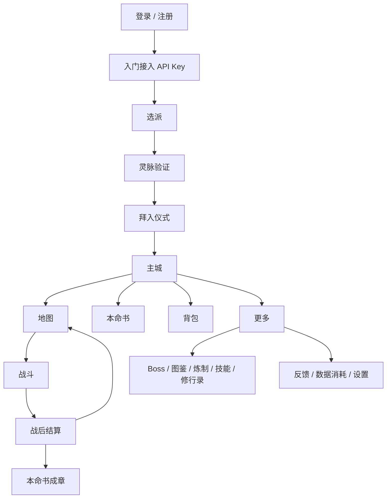

# 《灵枢笔录》移动端产品与 UI 适配设计方案

版本: v0.2 待确认  
日期: 2026-05-26  
范围: Web 移动端适配,覆盖登录、入门、主城、地图、战斗、本命书、背包、图鉴、Boss、炼制、技能、修行录、全局组件、横竖屏、弱网、后台恢复、内测反馈与监控闭环。

---

## 1. 设计结论

当前项目前端已经具备完整的桌面端玩法闭环,但移动端仍然主要是桌面布局缩小后的体验。v0.2 方案在 v0.1 的页面布局基础上,补齐移动端硬约束和内测闭环。

主要结论:

1. 不强制竖屏。竖屏作为默认体验,地图和战斗必须支持横屏专属布局。
2. 移动端页面不能继续依赖 `100vh`,统一改用 `100dvh / 100svh` 和 `visualViewport` 兜底。
3. 安全区必须覆盖 `top/right/bottom/left`,横屏 iPhone 的刘海位于侧边,不能只处理底部。
4. `BottomSheet`、`MobileAppShell`、`OfflineBoundary`、`ResumeController` 应进入 P0,否则后续页面会重复实现。
5. 地图不能依赖 hover 和双击。P0 至少实现点击详情、拖拽平移和底部详情抽屉。
6. 战斗必须按照移动弱网场景设计: WS 断线、LLM 断流、后台切换、误触返回都要有保护策略。
7. 内测版本不仅要有 `BETA` 标识,还要有反馈入口、崩溃/性能/行为监控和版本提示。
8. Token 消耗是核心成长逻辑,移动端要持续可见: 今日消耗、本月消耗、当前队列、章节状态、修为增长都要有明确反馈。
9. 不设置氪金项目,不做本地 token 省流模式。图片画质和动画降级只影响前端资源流量与性能,不降低 token 消耗目标。
10. 移动端改造应采用“主城聚合 + 地图沉浸 + 战斗控制台 + 本命书阅读器 + 更多功能页 + 内测反馈闭环”的产品结构。

---

## 2. 移动端产品目标

### 2.1 核心目标

1. 单手可玩: 竖屏主要操作集中在屏幕下半区。
2. 横屏可战: 地图和战斗在横屏下切换为左右信息结构,提升对峙感和操作效率。
3. 不阻塞: 战斗、墨炉、本命书生成、奇遇触发都应有进度反馈和可继续操作空间。
4. 清晰消耗: token 消耗通过墨炉队列、战斗 HUD、本命书章节状态、主城消耗卡片持续可见。
5. 轻层级: 玩家 2 次点击内进入主要行为: 打坐、地图、战斗、本命书、背包。
6. 内容沉浸: 本命书阅读、角色卡预览、Boss 名录在移动端要以阅读/收藏体验为主。
7. 弱网可恢复: 网络波动、后台切换、浏览器返回都不能让用户觉得“卡死”或“白扣 token”。
8. 内测可反馈: 每个关键页面都能低成本提交问题,后台能看到崩溃、慢接口、失败率和关键路径数据。

### 2.2 目标设备

最低可用:

- 320x568: iPhone SE 第一代、小屏 Android。
- 360x640: 低端 Android 竖屏。

主设计尺寸:

- 375x667: iPhone SE 第二/三代。
- 390x844: iPhone 12/13/14/15 常见宽度。
- 412x915: Android 主流宽度。
- 430x932: 大屏 iPhone。

增强适配:

- 600-767px: 折叠屏窄态、小平板竖屏,使用紧凑双栏。
- 768-1024px: iPad/小平板,使用双栏增强布局。
- 横屏高度 360-480px: 地图/战斗进入横屏控制台布局。

### 2.3 横竖屏策略

产品决策: 不强制竖屏。

原因:

1. 战斗左右对峙天然适合横屏。
2. 地图在横屏下可显示更宽探索区域。
3. 移动 H5 用户习惯自由旋转,强制竖屏会削弱游戏感。

页面策略:

| 页面类型 | 竖屏 | 横屏 |
| --- | --- | --- |
| 登录/注册/入门 | 单列表单 | 左品牌右表单,键盘弹起时收缩品牌区 |
| 选派 | 全屏门派卡轮播 | 左立绘,右信息与 CTA |
| 主城 | 今日修行仪表盘 | 左状态,右快捷入口与事件 |
| 地图 | 全屏地图 + 底部抽屉 | 左状态/导航,中地图,右详情/操作 |
| 战斗 | 上下压缩对峙 + 底部 action dock | 左玩家,中交锋/叙事,右敌人 + 底部横向招式 |
| 本命书 | 阅读 App 单列 | 左章节目录,右正文阅读 |
| 列表页 | 单列列表 + chips | 左筛选,右列表/详情 |

横屏兜底:

- 当视口高度小于 360px 时进入“超紧凑模式”,隐藏非核心装饰。
- 当横屏页面尚未完成专属布局时,显示轻提示“横屏适配中,建议竖屏继续”,但不阻断操作。
- 战斗和地图不得使用“建议竖屏”兜底,它们必须在 P0 支持横屏。

### 2.4 基础 UI 规则

- 点击热区不小于 44px。
- 固定元素使用完整安全区: `safe-area-inset-top/right/bottom/left`。
- 页面高度使用 `dvh/svh`,禁止关键布局使用裸 `100vh`。
- 主要按钮位于下半屏,横屏时位于右侧或底部拇指区。
- 不依赖 hover。hover 内容全部改为点击后的底部抽屉、侧边抽屉或详情页。
- 所有浮层支持点击遮罩关闭、下滑关闭、右上关闭。
- 重要流程中的关闭必须有确认,例如战斗中、表单填写中、token 任务提交后。
- 文本不随 viewport 宽度等比缩放,移动端使用固定字号阶梯。
- 卡片圆角控制在 8px 以内,保持现有设计基调。
- 游戏操作页禁止浏览器误缩放,阅读页通过应用内字号调节满足阅读需求。

---

## 3. 移动端信息架构

### 3.1 一级导航

移动端加入全局底部导航 `MobileTabBar`,仅在已登录且已创建角色后显示。

底部导航 5 个入口:

1. 主城 `/home`
2. 地图 `/explore`
3. 本命书 `/novel`
4. 背包 `/inventory`
5. 更多 `/more`

需要新增 `/more` 路由和 `More.vue` 页面。

“更多”承载:

- 修行物品 `/items`
- 修真名录 `/bosses`
- 山海经图鉴 `/bestiary`
- 炼丹炼器 `/craft`
- 修行心法 `/skills`
- 修行录 `/journal`
- 灵脉设置
- 内测反馈
- 数据与消耗

战斗页 `/battle/:id` 不进入底部导航常驻项,它是从地图、NPC、奇遇或 Boss 挑战进入的沉浸态页面。战斗页底部由战斗操作面板占用。

### 3.2 路由 Meta 规则

为了让全局 Shell 可控,每个路由需要增加移动端 meta:

```js
meta: {
  requireCharacter: true,
  mobileTab: 'home',
  mobileTitle: '主城',
  mobileImmersive: false,
  hideMobileTabBar: false,
  showQueueBar: true,
  showMapStatusBar: false,
  guardLeave: false,
}
```

建议规则:

| 路由 | mobileTab | hideMobileTabBar | showQueueBar | guardLeave |
| --- | --- | --- | --- | --- |
| `/home` | home | false | embedded 或 mini | false |
| `/explore` | explore | false | mini | false |
| `/novel` | novel | false | mini | false |
| `/novel/chapter/:id` | novel | true 或 auto-hide | mini | false |
| `/inventory` | inventory | false | mini | false |
| `/more` | more | false | mini | false |
| `/battle/:id` | none | true | mini only | true |
| `/onboarding` | none | true | false | true when dirty |
| `/sect-choose` | none | true | false | true when selected dirty |
| `/key-verify/:sectId` | none | true | false | true while verifying |
| `/initiation/:sectId` | none | true | false | true until completed |

### 3.3 全局信息层级

移动端全局层级从低到高:

1. 页面主体
2. 底部导航或横屏侧边导航
3. 页面顶部栏
4. 地图状态栏/战斗 HUD
5. 墨炉迷你条
6. 详情底部抽屉/横屏侧边抽屉
7. 模态弹窗: 奇遇、NPC、角色预览、反馈
8. 战斗特效/结算
9. 离线/错误全屏状态
10. 重要退出确认

### 3.4 页面流转



---

## 4. 移动端硬约束

### 4.1 Viewport Meta

建议改为:

```html
<meta
  name="viewport"
  content="width=device-width, initial-scale=1, maximum-scale=1, viewport-fit=cover"
/>
```

决策说明:

- `viewport-fit=cover`: 让安全区变量在 iOS 刘海屏上生效。
- `maximum-scale=1`: 游戏操作页避免误触双指缩放破坏布局。
- 本命书阅读通过应用内字号按钮解决可读性,而不是依赖浏览器缩放。
- P3 可为可访问性模式重新评估是否允许缩放。

### 4.2 视口高度

禁止在关键页面使用裸 `100vh`,尤其是战斗、地图、登录表单和本命书阅读器。

统一变量:

```css
:root {
  --app-vh: 100dvh;
  --app-svh: 100svh;
  --safe-top: env(safe-area-inset-top, 0px);
  --safe-right: env(safe-area-inset-right, 0px);
  --safe-bottom: env(safe-area-inset-bottom, 0px);
  --safe-left: env(safe-area-inset-left, 0px);
}

.mobile-page {
  min-height: var(--app-svh);
  min-height: 100dvh;
}
```

JS 兜底:

```js
function syncViewportVars() {
  const vv = window.visualViewport
  const h = vv?.height || window.innerHeight
  document.documentElement.style.setProperty('--visual-vh', `${h}px`)
}

window.visualViewport?.addEventListener('resize', syncViewportVars)
window.addEventListener('orientationchange', syncViewportVars)
```

使用场景:

- 战斗 action dock 固定到底部时使用 `--visual-vh` 防止键盘/地址栏导致遮挡。
- 登录页表单聚焦时使用 `visualViewport` 计算可见高度。
- 本命书阅读器避免地址栏收起时正文跳动。

### 4.3 安全区

所有固定元素都必须处理四向安全区。

底部元素:

```css
padding-bottom: calc(12px + var(--safe-bottom));
padding-left: calc(12px + var(--safe-left));
padding-right: calc(12px + var(--safe-right));
```

顶部元素:

```css
padding-top: calc(8px + var(--safe-top));
padding-left: calc(12px + var(--safe-left));
padding-right: calc(12px + var(--safe-right));
```

横屏侧边栏:

```css
.landscape-left-rail {
  padding-left: calc(10px + var(--safe-left));
}

.landscape-right-panel {
  padding-right: calc(10px + var(--safe-right));
}
```

### 4.4 滚动边界

移动端需要控制浏览器默认手势和页面内部滚动冲突。

建议:

```css
html,
body,
#app {
  overscroll-behavior: none;
}

.scrollable-content {
  overscroll-behavior: contain;
  -webkit-overflow-scrolling: touch;
}
```

注意:

- 列表内部允许自然滚动。
- 底部抽屉内部滚动不能带动页面滚动。
- 战斗页禁止页面整体滚动,只允许战报和卡牌区内部滚动。

---

## 5. 全局移动组件设计

### 5.1 MobileAppShell

职责:

- 根据路由 meta 决定是否显示底部导航、墨炉、顶部栏、状态栏。
- 注入全局安全区变量。
- 监听横竖屏、`visualViewport`、`visibilitychange`、`pageshow`。
- 统一处理离线、恢复、重要退出确认。

结构:

```text
MobileAppShell
├─ RouterView
├─ MobileTabBar
├─ CultivationQueueMini
├─ OfflineBoundary
├─ FeedbackEntry
├─ CharacterPreviewModal
└─ GlobalConfirmLeave
```

### 5.2 MobileTabBar

位置:

- 竖屏: 底部固定。
- 横屏: 高度小于 480px 时可变成左侧窄栏,只显示图标和短文字。

显示条件:

- 已登录。
- 已创建角色。
- 非登录/入门/战斗沉浸页。

交互:

- 点击切换一级页面。
- 当前页高亮。
- 本命书有新章显示小点。
- 墨炉运行时,本命书项显示“燃”小标。
- `/more` 显示未读反馈回复、设置风险或版本提示小点。

### 5.3 MobileTopBar

用于列表/详情页顶部:

- 左侧: 返回或页面标题。
- 中间: 当前模块名。
- 右侧: 刷新、筛选、搜索、反馈。

地图和战斗可以自定义顶部栏。

### 5.4 BottomSheet

P0 必做,不得推迟到 P2。

适用:

- 怪物详情
- 物品详情
- 技能详情
- Boss 详情
- 墨炉队列
- NPC 对话
- 奇遇
- 反馈表单
- 筛选器

规范:

- 竖屏默认高度 45%-65%。
- 竖屏可上拉到 90%。
- 横屏默认变为右侧抽屉,宽度 320-420px。
- 支持下滑关闭。
- 支持点击遮罩关闭。
- 支持 Escape/系统返回关闭。
- 标题栏固定,内容区域滚动。
- 主按钮固定在抽屉底部。
- 抽屉打开时锁住底层页面滚动。

### 5.5 墨炉移动态

当前墨炉在桌面端为侧边/顶部浮动。移动端采用“两态”:

1. 迷你态: 顶部右侧小胶囊,只显示图标、状态、token 数。
2. 展开态: 竖屏底部抽屉,横屏右侧抽屉。

状态机:

| 状态 | UI 文案 | 用户动作 |
| --- | --- | --- |
| idle | 墨炉空闲 | 查看本命书 |
| queued | 待燃 X 个 | 展开队列,取消未运行任务 |
| running | 燃灵中 | 查看进度,可离开页面 |
| retrying | 上游波动,重试中 | 查看重试次数 |
| interrupted | 断流待续 | 续写/重试 |
| paused | 已暂停 | 继续/取消 |
| budget_blocked | 预算保护 | 继续/取消 |
| failed | 成章失败 | 重试/反馈 |
| completed | 新章已成 | 查看章节 |

交互:

- 点击迷你态展开抽屉。
- 运行中每 1.8s 刷新状态。
- 后台切回前台立即刷新。
- 不遮挡底部导航和战斗操作面板。
- 在战斗页只显示迷你态,不要展开占用战斗区域。
- 任务完成时本命书 Tab 和主城墨炉卡同步显示新章提示。

### 5.6 打坐按钮移动态

移动端建议:

- 地图页显示为右下浮动大按钮,避开状态栏和底部导航。
- 主城页显示为主功能按钮之一。
- 战斗页不显示。
- 点击打坐立即恢复生命/灵气并降低疲劳。
- 连续点击保留连击反馈。
- 入定成章/闭关续写使用底部动作面板,不要悬浮小菜单。
- 横屏地图中放在右侧详情区或右下安全区。

### 5.7 角色预览移动态

点击角色绘画卡片后:

- 桌面端可用居中 Modal。
- 竖屏移动端改为全屏半页详情。
- 横屏移动端使用右侧详情抽屉。

Tabs:

1. 简介
2. 背景
3. 羁绊
4. 交互记录

内容要求:

- 角色完整立绘。
- 基础信息: 名称、门派、等级、境界、标签。
- 数值: 气血、灵气、修为、疲劳、攻击、防御、速度、暴击。
- 背景故事。
- 人物羁绊。
- 过往历史。
- 历史交互。
- 可跳转的关联章节或战斗记录。

### 5.8 OfflineBoundary

全局网络边界组件。

触发:

- `navigator.onLine === false`
- API 请求超时。
- WS 断线。
- LLM 流式中断。
- 页面恢复后 session 失效。

展示:

- 页面级错误: 列表/详情加载失败时使用。
- 全屏错误: 首屏无法加载角色、战斗无法恢复时使用。
- 顶部弱提示: 网络波动但仍可继续操作时使用。

文案原则:

- 告诉用户发生了什么。
- 告诉用户已保存什么。
- 给一个明确动作: 重试、返回地图、查看墨炉、重新登录、提反馈。

### 5.9 ResumeController

统一处理后台切换恢复。

监听:

- `visibilitychange`
- `pageshow`
- `focus`
- `online`
- `offline`

恢复动作:

1. 刷新角色状态。
2. 刷新墨炉队列。
3. 战斗页重新拉取战斗状态。
4. 列表页按需刷新当前页数据。
5. 检查登录 token 是否有效。
6. 恢复滚动位置和当前打开的抽屉。

### 5.10 GuardedLeave

统一拦截重要流程退出。

触发场景:

- 战斗进行中。
- 入门页表单已填写但未提交。
- 灵脉验证进行中。
- 本命书章节续写已提交但结果未返回。
- 墨炉任务刚创建但未进入队列确认态。

拦截方式:

- Vue Router `beforeRouteLeave`。
- `popstate`。
- `beforeunload`。
- 自定义返回按钮。

确认文案:

- 战斗中: “当前战斗仍在推演,离开后可从地图或战斗恢复入口继续。确定离开吗?”
- 表单中: “当前填写尚未保存,离开会丢失输入。”
- Token 任务中: “章节已入墨炉,离开不会中断燃灵,可在本命书查看进度。”

### 5.11 HapticFeedback

移动端爽点反馈。

实现:

```js
function vibrate(pattern = 30) {
  if (navigator.vibrate) navigator.vibrate(pattern)
}
```

触发建议:

- 出招成功: 20ms。
- 暴击: 40ms。
- 击败敌人: 80ms。
- 获得稀有掉落: `[30, 40, 60]`。
- 本命书新章完成: `[20, 30, 20]`。
- 操作失败: 15ms。

注意:

- 用户可在设置中关闭。
- 不支持的浏览器静默降级。

### 5.12 FeedbackEntry

BETA 内测必须有反馈入口。

入口:

- 主城右上角。
- 更多页固定入口。
- 错误页“提交问题”。
- 战斗异常提示中的“反馈本次战斗”。
- 本命书断章中的“反馈断章”。

反馈内容:

- 问题类型: Bug、卡顿、断章、战斗异常、UI 遮挡、建议。
- 文本描述。
- 自动附带: 设备尺寸、横竖屏、路由、版本号、用户 ID、最近错误、最近接口耗时。
- 可选截图。

P0 先做站内反馈表单和本地日志打包,P1 再接服务端存储或第三方工单。

### 5.13 Telemetry

BETA 看不到数据等于白测。P0 需要最小监控闭环。

采集:

- 页面访问。
- 首屏耗时。
- 接口错误率。
- WS 断线次数。
- 战斗平均等待时间。
- LLM 首字时间。
- 墨炉任务失败率。
- 章节断章率。
- 地图点击怪物到开战转化。
- 反馈提交量。

隐私:

- 不采集 API Key。
- 不采集完整章节正文,只采集长度、状态、错误类型。
- 用户可在设置中查看基础说明。

---

## 6. 页面级移动设计

### 6.1 登录页 `/login`

当前状态:

- 已完成登录/注册同页切换。
- 已新增 `BETA · 内测` 标识。

移动端目标:

- 强化这是内测版本。
- 表单足够大,避免键盘弹出时按钮不可见。
- 进入页面即可知道“当前是内测,数据可能调整”。

布局:

```text
┌─────────────────────┐
│         BETA 内测    │
│       Logo          │
│  执笔者,记录天地修行 │
│ [ 登录 ][ 注册 ]     │
│ 道号 input           │
│ 玄令 input           │
│ [ 入门 / 开宗 ]      │
│ 注册新道号           │
└─────────────────────┘
```

交互:

- 输入框聚焦时卡片上移,按钮不被键盘遮挡。
- 密码输入支持显示/隐藏。
- 注册时展示“内测期间数据可能调整”的短提示。
- 登录失败展示页面内错误,不只用 toast。
- 横屏时左品牌右表单。

### 6.2 欢迎页 `/`

移动端目标:

- 不做复杂长落地页。
- 明确“进入登录/继续修行”。

建议:

- 首屏只保留品牌名、核心一句话、主按钮。
- 版本信息和特性收到底部折叠区域。
- 横屏时减少动效背景,保证按钮首屏可点。

### 6.3 入门页 `/onboarding`

当前状态:

- 表单 + API 地址 preset + 探测可用门派。
- 已移除独立战斗模型配置。

移动端布局:

```text
┌─────────────────────┐
│ 接入灵脉             │
│ 道号                 │
│ API 地址             │
│ [preset 横向滚动]    │
│ API Key              │
│ [探索灵脉]           │
└─────────────────────┘
```

交互:

- Preset 改横向 chips。
- API Key 支持粘贴、清空、显示/隐藏。
- 探测中显示按钮 loading + 阶段提示。
- 探测结果不在本页铺满卡片,直接跳选派页。
- 表单 dirty 时离开需要确认。
- 5xx 自动重试最多 2 次,仍失败展示页面级错误和“复制错误信息”。

### 6.4 选派页 `/sect-choose`

当前状态:

- 桌面为大立绘 + 右侧信息 + 底部 dock。

移动端目标:

- 竖屏为全屏门派卡片轮播。
- 横屏为左立绘右信息。

布局:

```text
┌─────────────────────┐
│ 返回          门派 1/5│
│      大立绘          │
│ 沧澜剑派             │
│ 深思而后动...        │
│ [模型阶段] [属性]    │
│ [左右滑动切派]       │
│ [拜入此派]           │
└─────────────────────┘
```

手势:

- 左右滑动切换门派。
- 左边缘 24px 内不响应门派切换,避免 iOS 左滑返回冲突。
- 底部 dock 改为横向小头像。
- 不可选门派显示锁定态和缺失模型原因。

### 6.5 灵脉验证 `/key-verify/:sectId`

当前状态:

- 模型测试列表较长。

移动端目标:

- 流程感强,避免长列表造成焦虑。

交互:

- 顶部固定验证进度。
- 模型列表可折叠失败项详情。
- 全部通过后底部出现粘性 CTA。
- 验证中退出需要确认。
- 网络中断时保留已通过项,恢复后继续验证。

### 6.6 拜入仪式 `/initiation/:sectId`

当前状态:

- 动画化仪式、属性翻牌、机缘展示。
- 已有部分移动媒体查询。

移动端目标:

- 保留仪式感,减少 hover 依赖。

调整:

- 属性卡片 2 列。
- 属性详情从 hover 改为点击展开。
- 机缘 chip 点击打开小弹层。
- 结束按钮固定底部。
- 支持 `prefers-reduced-motion`,减少翻牌和闪光动画。

### 6.7 主城 `/home`

当前状态:

- 信息量最大: 主角状态、雷达图、新闻、日课、入口九宫格、战斗日志、墨炉。

移动端目标:

- 主城是“今日修行仪表盘”。

信息优先级:

1. 主角状态: HP、灵气、修为、疲劳
2. 今日消耗: 今日 token、本月 token、估算费用
3. 今日行动: 地图、打坐、本命书
4. 墨炉队列
5. 日课
6. 近期奇遇/战斗
7. 更多入口
8. 内测反馈入口

布局:

```text
┌─────────────────────┐
│ 顶栏: 头像 名字 设置 │
│ HP/灵气/修为/疲劳    │
│ 今日已燃 token       │
│ [开始修行] [打坐]    │
│ [本命书] [背包]      │
│ 墨炉迷你卡           │
│ 今日修行令           │
│ 最近事件             │
└─────────────────────┘
底部导航
```

交互:

- 角色雷达图默认折叠为“主角状态”卡片,点击展开。
- 九宫格入口改为 2 列快捷入口 + “更多”。
- 近期事件只展示 3 条,更多进入修行录。
- 灵脉设置放右上角设置按钮。
- 今日 token 卡点击进入“数据与消耗”详情。
- 横屏主城左侧状态,右侧事件和快捷入口。

### 6.8 地图 `/explore`

当前状态:

- 依赖鼠标悬停和双击。
- 地图最小高度 600px,头顶 tooltip。
- 状态栏只在地图显示。

移动端目标:

- 地图是触屏探索。
- 不使用 hover 和双击。
- P0 支持拖拽平移。
- 横屏显示更宽探索视野。

竖屏布局:

```text
┌─────────────────────┐
│ 回主城   修行地图  刷新│
│ HP/灵气/疲劳 状态条   │
│                     │
│      地图区域        │
│  怪物/NPC/玩家       │
│                     │
│ [怪物详情底部抽屉]    │
├─────────────────────┤
│ 主城 地图 本命书 背包 更多 │
└─────────────────────┘
```

横屏布局:

```text
┌──────┬──────────────────┬────────┐
│状态/ │                  │详情/   │
│导航  │      地图区域     │迎战    │
│      │                  │打坐    │
└──────┴──────────────────┴────────┘
```

怪物点击逻辑:

- 单击怪物: 打开详情抽屉。
- 抽屉主按钮: “迎战”。
- NPC: 打开 NPC 对话抽屉。
- 空白处: 关闭抽屉。
- 长按怪物: 打开角色预览。

地图手势:

- 单指拖拽: P0 支持地图平移。
- 双指缩放: P1/P2 增强,但 P0 不阻断平移。
- 点击回到玩家: 顶部或侧边提供定位按钮。

### 6.9 战斗 `/battle/:id`

当前状态:

- 桌面为左右战斗卡 + 中央交锋 + 叙事卷轴 + 卡牌面板。
- 已有出招预选队列。

移动端目标:

- 战斗页是沉浸式控制台。
- 角色与敌人始终可见。
- 出招按钮永远在拇指区。
- AI 叙事不阻塞下一次操作。
- 弱网和后台恢复不让用户丢失战斗上下文。

竖屏布局:

```text
┌─────────────────────┐
│ 回地图    回合/模型  │
│ 玩家 HP/气           │
│      VS              │
│ 敌人 HP              │
│ 叙事卷轴/战报         │
│ [招式][丹药][天命][赠礼]│
│ 卡牌横滑列表          │
└─────────────────────┘
```

横屏布局:

```text
┌────────┬──────────────┬────────┐
│ 玩家   │ 交锋/战报     │ 敌人   │
│ HP 气  │ 回合/模型/HUD │ HP     │
├────────┴──────────────┴────────┤
│ 招式横滑  丹药  天命  赠礼  撤退 │
└────────────────────────────────┘
```

关键改造:

- 玩家/敌人立绘竖屏上下压缩,横屏左右对峙。
- 叙事区高度固定,支持展开为全屏战报。
- 卡牌面板固定底部,使用横向滑动卡片。
- 招式、丹药、天命、赠礼、撤退保持在底部 action dock。
- “撤退”作为右上或底部次按钮,避免误触。
- 队列状态显示在底部卡牌上方。

等待体验:

- 出招后立即显示伤害结算/动效。
- LLM 叙事以“推演中”HUD 继续流式更新。
- 用户可继续点下一招进入队列。
- 若 3 秒无首字,显示本地兜底短叙事,战斗继续。

弱网策略:

- WS 断开后立即进入“重连中”状态,不直接踢回地图。
- 3 秒内尝试自动重连。
- 重连成功后拉取战斗状态并对齐本地 UI。
- 本地未发送的出招队列保存在 `sessionStorage`,TTL 5 分钟。
- 已发送但未确认的动作显示“对齐中”,不要重复发送,除非服务端支持幂等 action id。
- 重连失败后显示全屏状态: “战斗连接中断,已保留本地队列”,提供“重试连接 / 返回地图 / 提反馈”。

误触退出:

- 战斗未结束时返回必须确认。
- 系统后退、浏览器刷新、关闭页面都触发保护。
- 用户确认离开后,返回地图并保留可恢复入口。

### 6.10 战斗结算

移动端结算应独立为底部上拉卡或全屏卡。

内容:

- 胜/败/撤退。
- 奖励: 灵气、掉落、修为、token。
- 本命书章节状态: 已入墨炉/正在成章/断章/失败可重试。
- 主按钮: 返回地图。
- 次按钮: 查看本命书。
- 分享按钮: P2 加入。
- 反馈按钮: 战斗异常时展示。

### 6.11 本命书列表 `/novel`

当前状态:

- 统计栏 + 筛选 + 章节列表。

移动端目标:

- 像阅读 App 的书架。
- 章节状态与 token 消耗清晰可见。

布局:

```text
┌─────────────────────┐
│ 本命书        刷新    │
│ 总修为 token 章节 字数 │
│ [全部卷] [全部章型]   │
│ 章节卡片列表          │
└─────────────────────┘
```

交互:

- 筛选改横向 chips 或底部筛选抽屉。
- 章节卡显示: 标题、摘要、token、修为、断章状态。
- 运行中的墨炉任务在顶部显示“正在续写”。
- 下拉刷新。
- 返回列表恢复滚动位置。
- 空态引导“去地图战斗”或“打坐入定成章”。

### 6.12 本命书阅读 `/novel/chapter/:id`

移动端目标:

- 纯阅读优先。
- 弱网下已读章节仍可打开。

布局:

```text
┌─────────────────────┐
│ 返回       第 X 章    │
│ 标题                 │
│ token / 修为 / 模型   │
│ 正文                 │
└─────────────────────┘
```

交互:

- 顶部栏滚动时收起。
- 字号按钮: 小/中/大。
- 断章章节显示“续写此章”按钮,进入墨炉队列。
- Markdown 样式保持,移动端段落行高 1.8。
- 已读章节缓存到 IndexedDB,P1 实现。
- P2 支持章节长图分享和 Markdown 导出。

### 6.13 背包 `/inventory`

移动端目标:

- 从卡片网格改为列表 + 筛选 chips。

空态:

- 文案: “背包空空,去地图探索可获得材料与丹药。”
- 主按钮: “去地图”。

物品行:

- 左: 图标/稀有度。
- 中: 名称、描述、数量。
- 右: 使用/详情。

点击物品:

- 竖屏底部详情抽屉。
- 横屏右侧详情抽屉。
- 消耗品可直接使用。

### 6.14 修行物品 `/items`

移动端目标:

- 资料库页面,搜索优先。

布局:

- 顶部搜索固定。
- 类型筛选横滑。
- 单列物品卡。
- 详情用抽屉。
- 错误态保留搜索框和重试按钮。

### 6.15 炼丹炼器 `/craft`

移动端目标:

- 配方列表清晰,可炼制优先。

布局:

- 顶部筛选: 全部/丹药/装备/材料。
- 默认排序: 可炼制 > 解锁但材料不足 > 未解锁。
- 配方卡单列。
- 炼制按钮固定在卡片底部。

交互:

- 点击材料显示来源。
- 炼制成功后短动画 + 背包数量更新。
- 稀有炼制成功触发轻微震动。

### 6.16 技能 `/skills`

移动端目标:

- 技能像卡组管理。

布局:

- 顶部显示当前装备技能数量。
- 已装备横向栏。
- 可学技能单列卡片。
- 技能详情抽屉。

交互:

- 点击装备/卸下。
- 长按查看完整 lore 和数值。
- 横屏可左侧装备栏,右侧技能池。

### 6.17 山海经图鉴 `/bestiary`

移动端目标:

- 收藏图鉴体验。

布局:

- 顶部搜索。
- 族群筛选 chips。
- 怪物卡单列或 2 列小卡。
- 点击打开角色预览。

信息:

- 遭遇次数、击败次数、掉落发现。
- 未遭遇怪物显示剪影。
- 空态引导去地图探索。

### 6.18 修真名录 `/bosses`

当前状态:

- Boss 页面是名录和外传生成,没有稳定挑战入口。

移动端目标:

- Boss 名录应变成“故事线卷轴 + Boss 详情”。

布局:

```text
┌─────────────────────┐
│ 修真名录             │
│ [故事线 A B C D]     │
│ Boss 横向卡 / 单列卡 │
│ 详情底部抽屉          │
│ [挑战道君] [外传入墨炉]│
└─────────────────────┘
```

建议新增功能:

- “挑战道君”按钮: 调用 `battleApi.start(boss.id)`。
- 根据玩家等级显示挑战风险。
- 终极 Boss 需要前置故事线或等级条件,避免新手误点。
- 挑战失败也可生成败笔章,保持 token 消耗与叙事闭环。

### 6.19 修行录 `/journal`

移动端目标:

- 时间线。
- 长列表可恢复位置。

布局:

- 顶部类型筛选。
- 事件卡单列。
- 重要事件可展开详情。
- 超长列表显示回到顶部按钮。
- P1 加虚拟列表或分页加载。

### 6.20 更多 `/more`

新增页面。

目标:

- 收纳低频功能,减少主城拥挤。
- 承担内测反馈、设置、数据消耗入口。

布局:

```text
┌─────────────────────┐
│ 更多                 │
│ 数据与消耗           │
│ 修行物品 / 图鉴       │
│ 修真名录 / 炼制       │
│ 技能 / 修行录         │
│ 灵脉设置             │
│ 内测反馈             │
│ 版本与公告           │
└─────────────────────┘
```

功能分组:

1. 修行资料: 物品、图鉴、Boss 名录、修行录。
2. 养成管理: 炼制、技能、灵脉设置。
3. 内测服务: 反馈、版本公告、性能诊断。
4. 数据: token 消耗、导出本命书、账号信息。

### 6.21 奇遇弹窗

移动端目标:

- 从居中卷轴卡改为底部上拉卷轴。

内容:

- 奇遇类型、标题、正文。
- 效果 chips。
- 若触发战斗,主按钮“迎战”,次按钮“暂避”。

交互:

- 不自动跳战斗。
- 玩家明确点击“迎战”。
- 网络错误时保留奇遇内容,允许重试。

### 6.22 NPC 对话

移动端目标:

- 底部对话面板。

布局:

- 上方 NPC 头像/名称/意图。
- 中间描述。
- 下方动作按钮 2 列。
- 交易列表单列。

横屏:

- 右侧对话面板,地图保持可见。

---

## 7. 网络异常与恢复策略

### 7.1 错误类型

| 类型 | 场景 | UI |
| --- | --- | --- |
| offline | 设备无网络 | 全屏/顶部离线条 |
| timeout | 请求超时 | 页面级错误 + 重试 |
| 401/403 | 登录失效 | 无感续期,失败后重登 |
| 429 | 上游限流 | 倒计时 + 重试 |
| 5xx | 服务端异常 | 自动重试 + 页面错误 |
| ws_disconnect | 战斗连接断开 | 重连中 HUD |
| llm_stream_break | LLM 断流 | 保留进度 + 重试/续写 |
| task_failed | 墨炉任务失败 | 队列内失败态 |

### 7.2 自动重试原则

- GET 请求: 可自动重试 2 次。
- 幂等 POST: 需要 `idempotency_key`,可重试。
- 消耗 token 的任务创建: 必须由后端保证幂等,前端不能盲目重复提交。
- 战斗出招: 未确认发送前可保留队列,已发送后等待服务端状态对齐,避免重复结算。

### 7.3 无网络状态

全屏状态:

```text
网络暂离
你仍可阅读已缓存章节。
[重试连接] [回主城] [提交反馈]
```

页面局部状态:

- 列表加载失败: 保留标题、筛选器,显示错误卡和重试按钮。
- 图片加载失败: 显示占位图,不影响操作。
- 战斗断线: 显示重连遮罩,保留战斗 UI 背景。

### 7.4 后台切换恢复

高频场景: 玩家切到微信/QQ,30 秒后返回。

恢复策略:

1. `visibilitychange` 变为 hidden: 保存当前路由、滚动位置、打开抽屉、战斗本地队列。
2. `visibilitychange` 变为 visible: 触发轻量恢复。
3. `pageshow` 且 `event.persisted`: 处理 bfcache 恢复,强制刷新关键状态。
4. 战斗页: 重新拉取战斗状态,再决定是否恢复 WS。
5. 墨炉: 后端任务继续跑,前端恢复后立即刷新队列。
6. JWT 过期: 如果有刷新机制则静默续期;如果暂无刷新机制,保留目标路由并引导重登。

---

## 8. 移动端交互规范

### 8.1 iOS 左滑返回冲突

页面策略:

- 选派页左右滑动切派只在内容区生效,左边缘 24px 保留给系统返回。
- 战斗页进行中拦截路由返回,弹出确认。
- 地图拖拽从内容区开始,边缘滑动不触发地图平移。
- 底部抽屉下滑关闭只在抽屉头部和内容滚动到顶部时生效。

CSS:

```css
.battle-page,
.map-page {
  overscroll-behavior: none;
  touch-action: pan-x pan-y;
}

.bottom-sheet {
  overscroll-behavior: contain;
}
```

### 8.2 下拉刷新

建议:

- 本命书列表: P1 支持。
- 背包: P1 支持。
- 修行录: P1 支持。
- 图鉴/Boss 名录: P1 支持。
- 战斗页: 不支持下拉刷新。
- 地图页: 下拉刷新不作为主交互,使用顶部刷新按钮。

### 8.3 滚动恢复

需要恢复滚动的页面:

- 本命书列表。
- 背包。
- 修行录。
- 物品资料库。
- 图鉴。
- Boss 名录。

实现:

- 以路由 fullPath 为 key 存储 `scrollTop`。
- 进入详情页不清空列表状态。
- 返回列表后恢复筛选条件和滚动位置。
- 列表超过 2 屏后显示回到顶部按钮。

### 8.4 错误态 / 空态 / 骨架屏

统一规范:

- 首次加载: 骨架屏优先,避免全屏 spinner。
- 网络错误: 页面级错误卡 + 重试按钮 + 反馈入口。
- 空态: 给出下一步行为,不要只写“暂无数据”。

示例:

| 页面 | 空态引导 |
| --- | --- |
| 背包 | 去地图探索 |
| 本命书 | 去战斗或打坐入定 |
| 修行录 | 完成一次战斗 |
| 图鉴 | 去地图遭遇妖兽 |
| Boss 名录 | 完成主线故事或刷新名录 |

### 8.5 系统偏好

`prefers-reduced-motion`:

- 减少战斗闪光、地图漂浮、入门仪式大幅动画。
- 保留必要状态变化,不要完全静止。

`prefers-color-scheme`:

- 游戏强制深色主题。
- 不跟随系统切浅色,避免美术体系破裂。

系统字号/Dynamic Type:

- 移动端基础字号不随 viewport 缩放。
- 文本容器必须允许换行。
- 阅读器提供字号调节。
- P3 增加大字模式。

### 8.6 触觉反馈

默认开启,设置中可关闭。

触发:

- 点击主 CTA。
- 出招。
- 暴击。
- 战斗胜利。
- 稀有掉落。
- 本命书成章。
- 操作失败。

---

## 9. 资源加载与性能

### 9.1 图片资源

策略:

- 立绘、怪物、Boss 图使用响应式资源。
- 优先 WebP/AVIF,保留 PNG fallback。
- 为高 DPR 设备准备 `@2x/@3x` 或通过 CDN 参数生成。
- 章节阅读页不预加载大型战斗图。
- 从地图选中敌人时预加载战斗页需要的敌人资源。

画质选项:

- 自动: 默认。
- 高画质: Wi-Fi 或用户手动选择。
- 标准: 默认移动数据体验。
- 低资源: 只降低图片和动画资源,不降低 token 消耗,不改变模型和成章逻辑。

### 9.2 JS 与路由分包

当前项目已有路由懒加载,但构建存在大 chunk 风险。移动端建议:

- Naive UI 按需引入或拆分 vendor chunk。
- 战斗页、地图页、本命书阅读器独立 chunk。
- 图鉴/Boss/炼制/技能归入 secondary chunk。
- 欢迎页、登录页保持轻量。

目标:

- 登录首屏 JS 尽量小。
- 进入主城后再预加载地图和本命书。
- 从地图点击敌人时预加载战斗 chunk。

### 9.3 CSS 性能

注意:

- 大量 `backdrop-filter` 在低端机上成本高。
- 横屏战斗减少全屏 blur。
- 地图动画提供降级。
- 使用 `prefers-reduced-motion` 降低粒子和旋转。

### 9.4 本地缓存

可缓存:

- 已读章节正文: IndexedDB。
- 章节列表摘要: session cache。
- 图鉴静态资料: local cache。
- 图片资源: 浏览器缓存/PWA cache。

不可缓存:

- API Key 明文。
- 未授权用户数据。
- 未完成的 token 消耗请求结果。

---

## 10. 内测增长与反馈闭环

### 10.1 BETA 标识

登录页已加入 `BETA · 内测`。

还需要:

- 主城设置或更多页展示当前版本。
- 首次进入显示内测提示: 数据可能调整,欢迎反馈。
- 反馈入口常驻但不遮挡主要操作。

### 10.2 反馈通道

P0:

- 站内反馈表单。
- 自动附带设备与路由信息。
- 错误页一键反馈。

P1:

- 截图反馈。
- 最近 20 条前端日志附带提交。
- 反馈后显示追踪编号。

P2:

- QQ/微信群入口。
- 摇一摇反馈,仅移动端可选。
- 反馈状态通知。

### 10.3 分享与截图

P2 规划:

- 本命书章节生成长图。
- 战斗结算生成分享图。
- Boss 击败生成纪念图。
- 稀有掉落生成收藏图。

规则:

- 自动带水印: 游戏名、道号、章节/战斗时间。
- 不暴露 API Key、模型 Key、私密设置。
- 分享链接可打开公开只读页,P3 评估。

### 10.4 PWA

P2 规划:

- `manifest.json`。
- 主屏图标。
- 启动屏。
- 主题色。
- 添加到主屏引导。
- 基础离线页。

注意:

- PWA 缓存不能缓存用户 API Key。
- 新版本更新要有提示,避免旧资源导致页面异常。

### 10.5 通知

P2 规划:

- 本命书新章完成。
- 墨炉任务失败。
- Boss 故事线更新。
- 重要奇遇提醒。

优先级:

1. 站内红点。
2. 浏览器 Web Push。
3. 邮件通知,仅用户主动绑定后。

### 10.6 数据用量可见

主城和更多页增加“燃灵消耗”卡片。

展示:

- 今日已燃 token。
- 本月已燃 token。
- 当前墨炉预计 token。
- 本月估算费用。
- 消耗最高的模型/章节类型。

说明:

- 费用估算基于用户配置或后端维护的模型价格表。
- 不设置充值、不设置氪金项目。
- 该模块用于透明展示消耗,并强化 token 作为修行燃料的世界观。

---

## 11. 技术改造方案

### 11.1 新增组件

P0 新增:

1. `MobileAppShell.vue`
2. `MobileTabBar.vue`
3. `MobileTopBar.vue`
4. `BottomSheet.vue`
5. `MobileActionDock.vue`
6. `OrientationLayout.vue`
7. `OfflineBoundary.vue`
8. `ResumeController.js`
9. `GuardedLeave.js`
10. `FeedbackEntry.vue`
11. `More.vue`

P1 新增:

1. `MobileFilterChips.vue`
2. `PullToRefresh.vue`
3. `SkeletonBlock.vue`
4. `EmptyState.vue`
5. `ErrorState.vue`
6. `BackToTop.vue`
7. `HapticFeedback.js`
8. `ScrollRestore.js`

P2 新增:

1. `SharePoster.vue`
2. `PwaInstallPrompt.vue`
3. `NotificationCenter.vue`
4. `UsageDashboard.vue`

### 11.2 CSS 断点

建议统一:

```css
:root {
  --mobile-bottom-nav-h: 64px;
  --mobile-page-x: 16px;
  --safe-top: env(safe-area-inset-top, 0px);
  --safe-right: env(safe-area-inset-right, 0px);
  --safe-bottom: env(safe-area-inset-bottom, 0px);
  --safe-left: env(safe-area-inset-left, 0px);
}

@media (max-width: 359px) {
  /* 小屏紧凑模式 */
}

@media (min-width: 360px) and (max-width: 599px) {
  /* 主流手机竖屏 */
}

@media (min-width: 600px) and (max-width: 767px) {
  /* 折叠屏/小平板窄态 */
}

@media (min-width: 768px) and (max-width: 1024px) {
  /* 平板与大屏 */
}

@media (orientation: landscape) and (max-height: 480px) {
  /* 手机横屏 */
}
```

### 11.3 实施顺序

P0: 可用性与爆雷项

1. 登录页 Beta 标识。
2. `viewport-fit=cover` 与 `dvh/svh/visualViewport` 兜底。
3. 四向安全区变量。
4. `MobileAppShell` + 路由 meta。
5. `/more` 页面与底部导航。
6. `BottomSheet` 统一抽屉。
7. `OfflineBoundary` 全局网络错误。
8. `ResumeController` 后台恢复。
9. `GuardedLeave` 重要流程退出确认。
10. 主城移动布局,加入今日 token 消耗卡。
11. 地图点击详情 + 拖拽平移 + 横屏布局。
12. 战斗移动 action dock + 横屏布局 + WS 断线重连 UI。
13. 本命书移动阅读器基础版。
14. 空态/错误态/骨架屏基础组件。
15. 内测反馈入口和基础监控事件。

P1: 体验增强

1. iOS 左滑返回冲突细化。
2. 下拉刷新。
3. 列表滚动恢复。
4. 回到顶部。
5. 触觉反馈。
6. 系统偏好适配。
7. 图片画质策略。
8. 路由分包和资源预加载。
9. 背包、物品、炼制、技能单列化。
10. Boss 名录移动端重排。
11. 图鉴移动端重排。
12. 角色预览全屏/侧边移动态。

P2: 内测增长

1. 分享长图。
2. PWA 添加到主屏。
3. 通知中心。
4. Web Push。
5. 数据用量详情页。
6. 反馈截图和日志附带。
7. Boss 挑战入口与风险提示。
8. 本命书 IndexedDB 缓存。

P3: 长期演进

1. VoiceOver/TalkBack 可访问性。
2. 色弱模式。
3. iPad 外接键盘快捷操作。
4. i18n 工程预留。
5. 多账号切换。
6. 本命书全本导出 PDF/Markdown。
7. 公开只读分享页。

---

## 12. 验收标准

### 12.1 设备验收

竖屏:

- 320x568
- 360x640
- 375x667
- 390x844
- 412x915
- 430x932
- 768x1024

横屏:

- 568x320
- 667x375
- 844x390
- 915x412
- 932x430
- 1024x768

### 12.2 页面验收

1. 登录页 Beta 标识清晰,不遮挡 Logo 和表单。
2. 主城不横向滚动,核心状态首屏可见。
3. 主城显示今日 token 和本月 token。
4. 地图不依赖 hover,点击怪物可开详情并迎战。
5. 地图 P0 支持触屏平移。
6. 地图横屏下状态、地图、详情不互相遮挡。
7. 战斗页竖屏底部招式可单手点击。
8. 战斗页横屏左右对峙清晰,action dock 不遮挡立绘。
9. 本命书正文阅读无横向滚动。
10. 背包/技能/炼制等列表页单列可读。
11. 墨炉、打坐、底部导航互不遮挡。
12. 所有弹窗可关闭,不会卡死页面。
13. 重要流程退出会触发确认。
14. `/more` 能进入所有低频功能。
15. 反馈入口能提交问题并附带基础设备信息。

### 12.3 弱网验收

1. 断网后显示全局离线提示。
2. 列表加载失败有页面级重试,不是只有 toast。
3. 战斗 WS 断开后先重连,不立即踢回地图。
4. LLM 断流后显示保留进度和重试/续写入口。
5. 后台切换 30 秒后返回,角色、墨炉、战斗状态能重新同步。
6. JWT 过期后保留当前目标路由,重新登录后可返回。

### 12.4 性能验收

1. 首屏图片延迟加载。
2. 地图移动动画低端机不掉帧到不可操作。
3. 战斗 LLM 等待时仍可看到状态变化。
4. 页面切换无明显布局跳动。
5. iOS Safari 地址栏收起/展开时战斗 action dock 不跳飞。
6. 横屏安全区不遮挡按钮。
7. `prefers-reduced-motion` 下战斗和地图动画明显减少。

### 12.5 内测验收

1. 每个核心页面可提交反馈。
2. 前端记录核心错误和慢接口。
3. 反馈不包含 API Key。
4. 版本号可见。
5. 用户能看到 token 消耗。
6. 断章/失败任务可一键反馈。

---

## 13. 待确认问题

1. 移动端底部导航是否最终采用 5 项: 主城、地图、本命书、背包、更多。
2. 游戏操作页是否确认禁用浏览器双指缩放,阅读页通过字号按钮补偿。
3. 横屏是否按照“不强制竖屏,地图和战斗 P0 支持横屏”执行。
4. Boss 页面是否同时加入“挑战道君”入口。
5. 战斗页移动端叙事卷轴默认高度是否固定为屏幕 28%-34%。
6. 本命书已读章节是否允许 IndexedDB 缓存。
7. 反馈数据是否需要接后端接口,还是 P0 先保存本地日志并展示复制按钮。
8. token 费用估算是否由用户配置模型单价,还是仅展示 token 不展示金额。

---

## 14. 建议确认后的第一批落地任务

如果确认本方案,第一批不再只做页面样式,而是先补移动端地基:

1. `viewport-fit=cover`、`dvh/svh`、四向 safe-area、`visualViewport` 兜底。
2. `MobileAppShell`、路由 meta、`/more`、`MobileTabBar`。
3. `BottomSheet`、空态、错误态、骨架屏。
4. 全局离线/弱网提示、后台恢复、重要退出确认。
5. 主城移动布局 + 今日 token 消耗卡 + 反馈入口。
6. 地图移动布局 + 点击详情 + 拖拽平移 + 横屏三栏。
7. 战斗移动 action dock + 横屏对峙 + WS 断线恢复 UI。
8. 本命书移动阅读器 + 断章续写入口。

这批完成后,移动端主循环为:

主城查看状态与消耗 -> 地图拖拽探索 -> 点击怪物查看详情 -> 战斗出招 -> 弱网可恢复 -> 战后入墨炉 -> 本命书阅读 -> 回主城打坐恢复。

该循环完整后,再进入 P1 的列表、图鉴、Boss、炼制、技能与体验增强。
